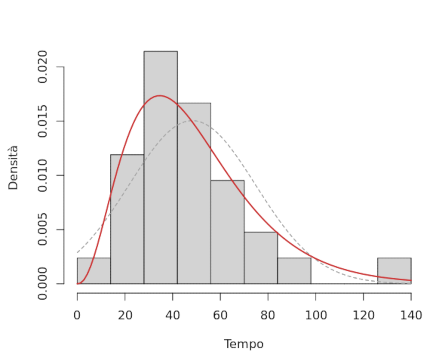

# Momenti

Il $k$-esimo **momento di popolazione** è definito come:
$$
\mu_k = E(X^k)
$$
mentre il suo **momento campionario** è:
$$
M_k = \frac{1}{n}\sum_{i = 1}^n X_i^k
$$
entrambi con la loro variante **centrale**, cioè $\mu_k' = E((X - \mu)^k)$ e $M_k' = \frac{1}{n}\sum\limits_{i = 1}^n (X_i - \bar{X})^k$.

Da questi si può quindi notare che $M_1 = \bar{X}$ e $M_2' = \frac{n-1}{n}S^2 \approx S^2$.

Per cui, il **metodo dei momenti** stima $\theta$ confrontando più $\mu_k$ con gli $M_k$:
$$
\begin{cases}
\mu_1 = M_1 \\
... \\
\mu_k = M_2
\end{cases}
$$

Per esempio, per stimare $\alpha$ e $\lambda$ di $X \sim \mathrm{Ga}(\alpha, \lambda)$ dell'[esempio precedente](../01/01/README.md) basta risolvere:
$$
\begin{cases}
\mu_1 = m_1 \\
\mu_2 = m_2'
\end{cases} \Leftrightarrow
\begin{cases}
\frac{\alpha}{\lambda} = \bar{x} \\
\frac{\alpha}{\lambda^2} = \frac{29}{30}s^2
\end{cases} \Leftrightarrow
\begin{cases}
\frac{\alpha}{\lambda} = 48.23 \\
\frac{\alpha}{\lambda^2} = 703.2
\end{cases} \Leftrightarrow
\begin{cases}
\hat{\alpha} = 3.42 \\
\hat{\lambda} = 0.07
\end{cases}
$$
che risulta nella distribuzione:

