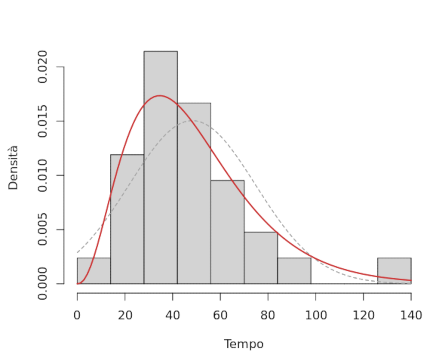

# Stima

Il **modello statistico** del _campione_ muta col _parametro_ $\theta$ che può variare nello **spazio parametrico** $\Theta \subset \mathbb{R}^k$.

## Momenti

Il $k$-esimo **momento di popolazione** è definito come:
$$
\mu_k = E(X^k)
$$
mentre il suo **momento campionario** è:
$$
M_k = \frac{1}{n}\sum_{i = 1}^n X_i^k
$$
entrambi con la loro variante **centrale**, cioè $\mu_k' = E((X - \mu)^k)$ e $M_k' = \frac{1}{n}\sum\limits_{i = 1}^n (X_i - \bar{X})^k$.

Da questi si può quindi notare che $M_1 = \bar{X}$ e $M_2' = \frac{n-1}{n}S^2 \approx S^2$.

Per cui, il **metodo dei momenti** stima $\theta$ confrontando più $\mu_k$ con gli $M_k$:
$$
\begin{cases}
\mu_1 = M_1 \\
... \\
\mu_k = M_2
\end{cases}
$$

Per esempio, per stimare $\alpha$ e $\lambda$ di $X \sim \mathrm{Ga}(\alpha, \lambda)$ dell'[esempio precedente](../01/01/README.md) basta risolvere:
$$
\begin{cases}
\mu_1 = m_1 \\
\mu_2 = m_2'
\end{cases} \Leftrightarrow
\begin{cases}
\frac{\alpha}{\lambda} = \bar{x} \\
\frac{\alpha}{\lambda^2} = \frac{29}{30}s^2
\end{cases} \Leftrightarrow
\begin{cases}
\frac{\alpha}{\lambda} = 48.23 \\
\frac{\alpha}{\lambda^2} = 703.2
\end{cases} \Leftrightarrow
\begin{cases}
\hat{\alpha} = 3.42 \\
\hat{\lambda} = 0.07
\end{cases}
$$
che risulta nella distribuzione:

## Verosimiglianza

La funzione di **verosimiglianza** indica la probabilità dell'aver osservato un certo _campione_ $X_1, ..., X_n$:
$$
L(\theta) \propto P(X_1 = x_1 \land ... \land X_n = x_n)
$$
se si tratta di un **problema di stima regolare**, ovvero se il dominio delle $X_i$ non dipende da $\theta$.

Dopo aver trovato $L(\theta)$ attraverso un **modello** sul _campione_ si può cercare il migliore valore di $\theta$ che la massimizza, e quindi adatta meglio il modello ai dati, con la derivata [prima](../../ct0432/05/04/README.md#studio-del-segno-della-derivata) e [seconda](../../ct0432/05/07/README.md#convessità-e-concavità-locale-e-punti-di-flesso):
$$
\frac{d}{d\theta}L(\theta) = 0\ \land\ \frac{d^2}{d^2\theta}L(\theta) < 0
$$

Quando il _campione_ è **indipendente** la _verosimiglianza_ diventa:
$$
L(\theta) \propto \prod_{i = 1}^n P(X_i = x_i)
$$
e quindi si preferisce usare la **log-verosimiglianza**, che semplifica il calcolo delle derivate:
$$
\ell(\theta) = \ln L(\theta) \propto \sum_{i = 1}^n \ln P(X_i = x_i)
$$

Nel caso **continuo**, $L(\theta) \propto f(x_1, ..., x_n) = \prod\limits_{i = 1}^n f(x_i)$ perchè $f(x_i)$ è l'area del [plurirettangolo](../../ct0432/10/03/README.md#integrali-definiti) con base $1$.

Per esempio, se $f(x) = \lambda e^{-\lambda x}$ si può stimare $\lambda$ con un _campione_ $X_1, ..., X_n$:
$$
L(\lambda) \propto \prod_{i = 1}^n \lambda e^{-\lambda x_i} = \lambda^n \prod_{i = 1}^n e^{-\lambda x_i} = \lambda^n e^{-\lambda \sum\limits_{i = 1}^n x_i} \\[0.5em]
\Downarrow \\
\ell(\lambda) \propto n\ln\lambda - \lambda\sum_{i = 1}^n x_i \\
\Downarrow \\
\ell'(\lambda) = \frac{n}{\lambda} - \sum_{i = 1}^n x_i\ \land\ \ell''(\lambda) = -\frac{n}{\lambda^2} < 0, \forall \lambda \\
\Downarrow \\[0.5em]
\ell'(\lambda) = 0 \Leftrightarrow \hat{\lambda} = \frac{n}{\sum\limits_{i = 1}^n x_i}
$$
