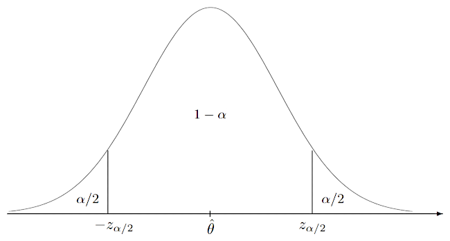

# Intervalli di confidenza

Un $[A, B]$ è detto **intervallo di confidenza** per $\theta$ di livello $(1-\alpha) 100\%$ se ha **livello di confidenza**:
$$
P(A \leq \theta \leq B) = 1 - \alpha
$$
dove $\theta$ è un **numero** mentre $A$ e $B$ sono **variabili casuali** perchè dipendono dal campione.

## Intervalli di trasformazioni

Dato uno stimatore $\theta$ con  _intervallo di confidenza_ $[A, B]$, una sua **trasformazione** $\psi = g(\theta)$ ha intervallo:
- $[g(A), g(B)]$ se $g$ è **crescente**, perchè $P(g(A) \leq g(\theta) \leq g(B)) = P(A \leq \theta \leq B)$
- $[g(B), g(A)]$ se $g$ è **decrescente**

Le **trasformazioni** possono anche migliorare l'approssimazione del _livello di confidenza_.
Per esempio, se $\theta$ è vicino a $0$, si può trovare l'intervallo $[A, B]$ di $\psi = \log\theta$ e poi si ritorna a $\theta = g(\psi) = e^\psi$ con $[e^A, e^B]$.
