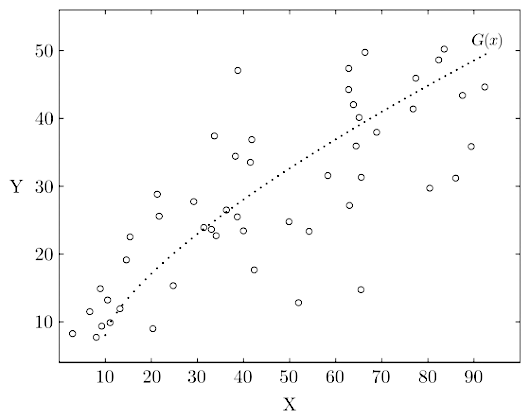

# Regressione

La **dipendenza** può essere verificata valutando se la variabile **predittore** $X$ prevede la variabile **risposta** $Y$.

Attraverso un **modello di regressione**, è possibile quindi valutare la predittività di $X$ su $Y$:
$$
G(x) = E(Y \mid X = x)
$$

Tra questi, quello più semplice è la **retta di regressione lineare**, che non dimostra relazioni quando $\beta_1 = 0$:
$$
G(x) = \beta_0 + \beta_1 x
$$
