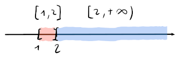
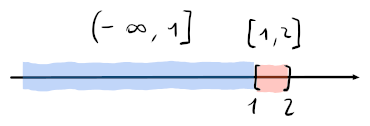
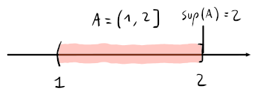
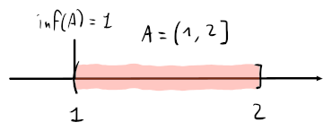

# Estremi

## Maggioranti e minoranti

Di un insieme $A \subseteq \mathbb{R}$, si dice **insieme maggiorante** l'insieme di tutti i $b \in \mathbb{R} : b \geq x, \forall x \in A$. \
Per esempio, con $\{-3, 1, 5\}$, $b$ è maggiorante se $b \geq 5$; con $\mathbb{N}$ invece, il maggiorante non esiste.

Un **insieme minorante** invece, è l'insieme di tutti i $a \in \mathbb{R} : a \leq x, \forall x \in A$. \
Per esempio, con $\mathbb{N}$, $a$ è minorante se $a \leq 0$ (con $a \in \mathbb{R}$).

Quando un insieme non possiede dei maggioranti si dice **superiormente illimitato**, mentre quando non possiede dei minoranti si dice **inferiormente illimitato**.

## Estremo superiore e inferiore

In un insieme si dice **estremo superiore** o $\sup(A)$, l'elemento più piccolo dei suoi maggioranti.

Vale la proprietà per cui su un insieme $A \subseteq \mathbb{R}$ _superiormente limitato_, $\exists a \in A : a > \sup(A) - \epsilon, \forall \epsilon > 0$, cioè che ci sarà sempre un punto in $A$ che sta in mezzo tra un altro punto (dato dalla differenza $\epsilon$) e l'estremo superiore, qualsiasi sia $\epsilon$.

Mentre si dice **estremo inferiore** o $\inf(A)$, l'elemento più grande dei suoi minoranti.

Anche qui, vale la proprietà per cui su un insieme $A \subseteq \mathbb{R}$ _inferiormente limitato_, $\exists a \in A : a < \inf(A) + \epsilon, \forall \epsilon > 0$.

## Massimo e minimo

In un insieme $A$, se $\sup(A) \in A \Rightarrow \sup(A)$ corrisponde al **massimo**, cioè il più piccolo dei maggioranti contenuto in $A$.

Invece, se $\inf(A) \in A \Rightarrow \inf(A)$ è il **minimo**, cioè il più grande dei minoranti contenuto in $A$.
