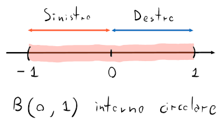

# Intervalli

Un intervallo $I$ (e.g. $[0, 2]$) si può definire come $\forall x, y \in I : x \leq y \Rightarrow z \in I, \forall z \in \mathbb{R} : x \leq z \leq y$, e cioè che tra qualunque coppia di punti arbitrari $x$ e $y$ (con $x \leq y$) dentro $I$, ci saranno infiniti punti $z \in \mathbb{R}$ tra $x$ e $y$ inclusi in $I$.

Alcuni tipi di combinazioni di intervalli possono essere:
- $(a, b)$ o $]a, b[$: limitato, aperto
- $[a, b]$: limitato, chiuso
- $[a, b)$: limitato, chiuso a sinistra e aperto a destra
- $(a, +\infty)$: illimitato superiormente e aperto a sinistra
- $(-\infty, b]$: illimitato inferiormente e chiuso a destra
- $(-\infty, +\infty)$: illimitato (e uguale ad $\mathbb{R}$)
- $[a, a] = \{a\}$
- $(a, a) = [a, a) = (a, a] = \emptyset$

## Proprietà

- $\emptyset$ è l'unico insieme ad essere sia aperto che chiuso
- Con $A, B$ aperti, $A \cup B$ e $A \cap B$ sono aperti
- $\bigcup_{n=1}^{+\infty}A_n$, cioè l'unione di infiniti intervalli, è aperta
- $\bigcap_{n=1}^{+\infty}A_n$, cioè l'intersezione di infiniti intervalli, può non essere aperta

	Per esempio, con $n \in \mathbb{N}$:

	$$\bigcap_{n=1}^{+\infty} \left(-\frac{1}{n}, \frac{1}{n}\right) = A_1 \cap A_2 \cap ... \cap A_n = \{0\} = [0, 0]$$

	Che dimostra che l'intersezione di infiniti intervalli che diventano sempre più piccoli su $0$ è $\{0\}$.

- Con $A, B$ chiusi, $A \cup B$ e $A \cap B$ sono chiusi
- $\bigcap_{n=1}^{+\infty}A_n$, cioè l'intersezione di infiniti intervalli, è aperta
- $\bigcup_{n=1}^{+\infty}A_n$, cioè l'unione di infiniti intervalli, può non essere chiusa

	Per esempio, con $n \in \mathbb{N}$:

	$$\bigcup_{n=1}^{+\infty} \left[-n, n\right] = A_1 \cup A_2 \cup ... \cup A_n = \mathbb{R}$$

	Che dimostra che l'unione di infiniti intervalli che diventano sempre più grandi è $\mathbb{R}$, che è aperto.

## Teorema di Cantor

Dati $I_n$ intervalli **chiusi e limitati**, tale che $I_{n+1} \subseteq I_n$ allora $\exists c \in \mathbb{R} : c \in \bigcap_{n = 1}^{+\infty} I_n$.

Inoltre, se l'ampiezza di $I_n$ tende a diminuire con l'aumentare di $n$, allora $\bigcap_{n=1}^{+\infty} I_n = \{c\}$, con $c \in \mathbb{R}$.

## Intorni

Dato un punto $p \in \mathbb{R}$, si chiamerà **intorno di** $p$ un qualunque intervallo aperto $]a, b[ \in \mathbb{R}$, che contenga il punto $p$.

Avendo un raggio $r > 0$:
- $B(p, r) = (p - r, p + r)$ si chiamerà **intorno circolare aperto** di $p$
- $(p - r, p]$ sarà l'**intorno sinistro** di $p$
- $[p, p + r)$ sarà l'**intorno destro** di $p$

Inoltre, chiamiamo $\overline B(p, r) = [p - r, p + r]$ **intorno circolare chiuso** di $p$.

### Punti interni ed esterni

Un punto $x$ si dice **interno** ad un intervallo $A$ se $x \in A$ e $\exists r > 0 : B(x, r) \subset A$, di conseguenza $\sup(A)$ e $\inf(A)$ non sono considerabili come punti interni ad $A$.

Un punto $x$ è detto **esterno** invece, se $\exists r > 0 : B(x, r) \subset A^C$ cosa che, anche in questo caso, esclude gli estremi.

Il simbolo $\mathring A$ corrisponde all'**insieme di tutti i punti interni** ad $A$, e $A = \mathring A$ quando $A$ è aperto.

### Punti di frontiera

Un punto $x$ si dice **di frontiera** ad un intervallo $A$ se $\exists y \in A, \exists z \in A^C : y, z \in B(x, r), \forall r > 0$, cioè che la palla $B(x, r)$ includerà sia alcuni punti di $A$, che alcuni punti di $A^C$, e di conseguenza $x$ non è né interno né esterno, ma _di frontiera_ tra $A$ e il suo complementare.
