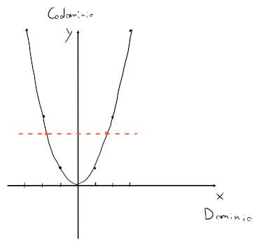

# Tipi di funzione

Una funzione
$$
\begin{split}
f\colon &A \to B\newline
&x \mapsto y = f(x)
\end{split}
$$

si dice:
- **Suriettiva** se $\mathrm{Im}(f) = B$, e cioè che il codominio corrisponde a tutti punti di $f(x)$
- **Iniettiva**, se per ogni $x$ esiste una sola $f(x)$
- **Biettiva**, se la funzione è sia **suriettiva** che **iniettiva**

### Esempio

Sia $f$ la funzione $f : \mathbb{R} \to \mathbb{R} : x \mapsto y = x^2$.

La parabola quindi **non è suriettiva** perchè ci sono dei punti del codominio che non fanno parte di $\mathrm{Im}(f)$ (i.e. $y < 0$), ma **neanche iniettiva** perchè esistono delle $x$ diverse per cui $f(x)$ restituisce lo stesso risultato (i.e. i due punti arancioni).

## Restrizioni di funzioni

Restringere una funzione può portarla a diventare _suriettiva_ o _iniettiva_.
Questo è possibile cambiando il suo **dominio** e **codominio**.

Per la parabola $y = x^2$, essa diventa _suriettiva_ se si **restringe il suo dominio** a $D = [0, +\infty)$ (espressa come $f_{|D}$), mentre diventa _iniettiva_ se si **restringe il suo codominio** a $C = [0, +\infty)$.

## Funzioni monotone

Una funzione viene chiamata **monotona** quando soddisfa una delle seguenti proprietà:
- **Crescente**, se $f(x) \leq f(z), \forall x, z \in D : x < z$
- **Decrescente** se $f(x) \geq f(z), \forall x, z \in D : x < z$
- **Strettamente crescente** se $f(x) < f(z)$
- **Strettamente decrescente** se $f(x) > f(z)$
- **Costante**, se $|f(D)| = 1$ e quindi $f(x) = f(z)$ (e.g. le rette orizzontali)
