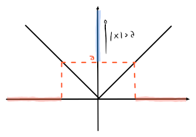

# Valore assoluto e segno

## Valore assoluto

$$
\begin{split}
f\colon &\mathbb{R} \rightarrow \mathbb{R^+}\newline
&x \mapsto |x|
\end{split}
$$
dove
$$
|x| =
\begin{cases}
x & \text{se } x \geq 0 \\
-x & \text{se } x < 0
\end{cases}
$$
e valgono le seguenti proprietà:

- $|x| < a \Rightarrow -a < x < a$

	

- $|x| > a \Rightarrow x < -a \lor x > a$

	

- $|a + b| \leq |a| + |b|$ e $|a - b| \geq ||a| - |b||$, anche chiamate **disuguaglianze triangolari**

## Funzione segno

$$
\begin{split}
f\colon &\mathbb{R} \rightarrow \mathbb{R}\newline
&x \mapsto \mathrm{sgn}(x)
\end{split}
$$
dove
$$
\mathrm{sgn}(x) =
\begin{cases}
1 & \text{se } x > 0 \\
0 & \text{se } x = 0 \\
-1 & \text{se } x < 0
\end{cases}
$$
