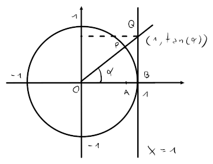
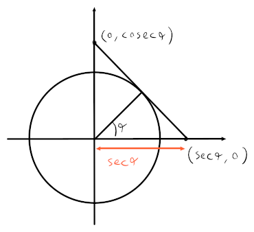

# Trigonometriche

L'angolo $\alpha$ viene ordinariamente rappresentato in **radianti** invece che _gradi_ (e.g. $\pi = 180^\circ$).

L'equazione di un cerchio è quindi, per il **teorema di pitagora**:
$$x^2 + y^2 = r^2$$
dove $r$ è il raggio. I valori di $x$ e $y$ sono ricavabili conoscendo l'angolo $\alpha$:
$$
y = r \cdot \sin(\alpha) \\
x = r \cdot \cos(\alpha)
$$

Nel caso della **circonferenza unitaria**, cioè con raggio $r = 1$, si hanno le seguenti proprietà:
- $x = \cos(\alpha)$
- $y = \sin(\alpha)$
- $\cos(\alpha), \sin(\alpha) \in [-1, 1]$
- Le funzioni sono **periodiche** con $T = 2\pi$
- $\cos(-\alpha) = \cos(\alpha)$ quindi è **simmetrica** rispetto all'asse $y$
- $\sin(-\alpha) = -\sin(\alpha)$ quindi è **simmetrica** rispetto all'origine
- $\cos(\alpha + \beta) = \cos(\alpha)\cos(\beta) - \sin(\alpha)\sin(\beta)$
- $\sin(\alpha + \beta) = \sin(\alpha)\cos(\beta) + \sin(\beta)\cos(\alpha)$
- $\cos^2(\alpha) + \sin^2(\alpha) = 1$

Dalle ultime tre formule è possibile ricavarsi che:
- $\sin(2\alpha) = 2\sin(\alpha)\cos(\alpha)$
- $\cos(2\alpha) = \cos^2(\alpha) - \sin^2(\alpha) = 1 - 2\sin^2(\alpha) = -1 + 2\cos^2(\alpha)$
- $\sin^2(\alpha) = \frac{1 - \cos(2\alpha)}{2}$
- $\cos^2(\alpha) = \frac{1 + \cos(2\alpha)}{2}$

## Tangente

Per trovare la **tangente** di un angolo $\alpha$, si può fare la proporzione tra un triangolo $\triangle OAP$, dove $P = (\cos(\alpha), \sin(\alpha))$, con il triangolo $\triangle OBQ$ per trovare $\overline{BQ} = \tan(\alpha)$ dove $Q$ corrisponde al punto in cui la retta di angolo $\alpha$ si interseca con $x = 1$:

$$\overline{OA} : \overline{OB} = \overline{AP} : \overline{BQ}$$
$$\cos(\alpha) : 1 = \sin(\alpha) : \tan(\alpha) \Rightarrow \tan(\alpha) = \frac{\sin(\alpha)}{\cos(\alpha)}$$

Questo implica anche che $\alpha \neq \frac{pi}{2} + k\pi, k \in \mathbb{Z}$.

La funzione è **dispari**, perchè il grafico della funzione è simmetrico rispetto all'origine, ed è periodica con $T = \pi$.

## Inverse

Perchè le funzioni trigonometriche siano invertibili vanno ristrette sul dominio rendendole **biettive**.

- **Seno**
	$$\sin\colon \left[-\frac{\pi}{2}, \frac{\pi}{2}\right] \rightarrow [-1, 1]$$

	$$\arcsin\colon [-1, 1] \rightarrow \left[-\frac{\pi}{2}, \frac{\pi}{2}\right]$$

- **Coseno**
	$$\cos\colon [0, \pi] \rightarrow [-1, 1]$$

	$$\arccos\colon [-1, 1] \rightarrow [0, \pi]$$

- **Tangente**
	$$\tan\colon \left(-\frac{\pi}{2}, \frac{\pi}{2}\right) \rightarrow (-\infty, +\infty)$$

	$$\arctan\colon (-\infty, +\infty) \rightarrow \left(-\frac{\pi}{2}, \frac{\pi}{2}\right)$$

## Cotangente

La **cotangente** usa lo stesso concetto della **tangente**, ma invece che trovare l'intersezione su $x = 1$, si trova il valore dell'intersezione su $y = 1$.
$$\cot(\alpha) = \frac{\cos(\alpha)}{\sin(\alpha)} = \frac{1}{\tan(\alpha)}$$

## Secante

La **secante** invece, cerca l'intersezione su $y = 0$, della tangente che sta sul punto di intersezione tra la retta di angolo $\alpha$ e la circonferenza.
$$\sec(\alpha) = \frac{1}{\cos(\alpha)}, \hspace{1em} \cosec(\alpha) = \frac{1}{\sin(\alpha)}$$

