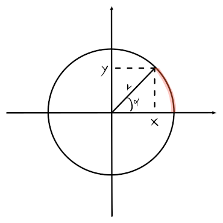

# Trigonometriche

L'angolo $\alpha$ viene ordinariamente rappresentato in **radianti** invece che _gradi_ (e.g. $\pi = 180^\circ$).

L'equazione di un cerchio è quindi, per il **teorema di pitagora**:
$$x^2 + y^2 = r^2$$
dove $r$ è il raggio. I valori di $x$ e $y$ sono ricavabili conoscendo l'angolo $\alpha$:
$$
y = r \cdot \sin(\alpha) \\
x = r \cdot \cos(\alpha)
$$

Nel caso della **circonferenza unitaria**, cioè con raggio $r = 1$, si hanno le seguenti proprietà:
- $x = \cos(\alpha)$
- $y = \sin(\alpha)$
- $\cos(\alpha), \sin(\alpha) \in [-1, 1]$
- Le funzioni sono **periodiche** con $T = 2\pi$
- $\cos(-\alpha) = \cos(\alpha)$ quindi è **simmetrica** rispetto all'asse $y$
- $\sin(-\alpha) = -\sin(\alpha)$ quindi è **simmetrica** rispetto all'origine
- $\cos(\alpha + \beta) = \cos(\alpha)\cos(\beta) - \sin(\alpha)\sin(\beta)$
- $\sin(\alpha + \beta) = \sin(\alpha)\cos(\beta) + \sin(\beta)\cos(\alpha)$
- $\cos^2(\alpha) + \sin^2(\alpha) = 1$
