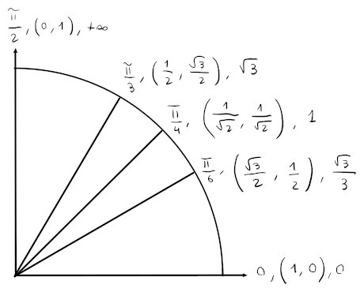

# Angoli notevoli

Con il teorema di pitagora, è possibile ricavarsi i $45^\circ = \frac{\pi}{4}$, mentre sapendo che $\cos(\frac{\pi}{6}) = \sin(\frac{\pi}{3})$ ci si può ricavare $30^\circ = \frac{\pi}{6}$ e anche i $60^\circ = \frac{\pi}{3}$ invertendo poi il seno e il coseno.
