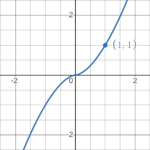
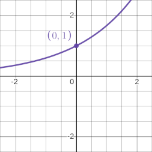
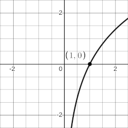

# Funzioni elementari

| Punto in comune | Tipo | Funzione |
|:-:|:-:|:-:|
|  | **Potenza** | $x^n$ |
|  | **Esponenziale** | $n^x$ |
|  | **Logaritmo** | $\log_n(x)$ |

Queste famiglie di funzioni hanno dei punti in comune, che [fanno da perno](https://www.desmos.com/calculator/j01sq8zsz3) cambiando $n$.
