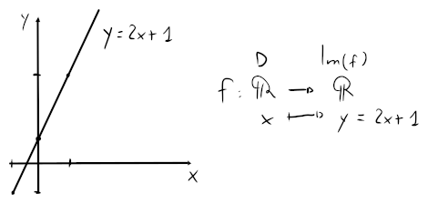

# Funzioni

La funzione $f$ è **funzione** da un insieme $A$ ad un insieme $B$ se $\forall x \in A, \exists!y \in B : x \to y$, dove $x \to y$ significa che da $x$ si va a $y$ tramite la funzione $f$.

Dato che $f$ va da $A$ a $B$, $A$ è chiamato **dominio** (o $D$), mentre $B$ è chiamato **codominio** (o $f(D)$).

La funzione verrà quindi descritta come
$$
\begin{split}
f\colon &A \to B\newline
&x \mapsto y = f(x)
\end{split}
$$
con $x \in A$ e $y \in B$, dove $x$ è detta **variabile indipendente** mentre $y$ **variabile dipendente**.

Per esempio, la seguente funzione:

## Grafico

Un **grafico** di una funzione $f: D \to \mathbb{R}$ viene indicato con $G(f)$ e corrisponde al sottoinsieme dei punti del piano cartesiano $\mathbb{R}^2$ messi in relazione da $f$:
$$G(f) = \{(x, y) \in \mathbb{R}^2 | x \in D \land y = f(x)\}$$
