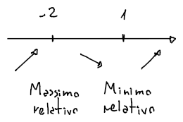

# Proprietà locali

Una funzione $f$ può essere **crescente** o **decrescente** localmente rispetto ad un punto $x_0$.

Può quindi soddisfare le **proprietà locali**:
- **Crescente**:
$$
f \text{ crescente in } x_0 \Leftrightarrow
\exists I_{x_0} : f(x) \leq f(x_0), \forall x \in I_{x_0} : x < x_0 \land
f(x) \geq f(x_0), \forall x \in I_{x_0} : x > x_0
$$
	cioè se esiste un intorno $I_{x_0}$ per cui l'immagine dell'**intorno sinistro** di $x_0$ (dentro $I_{x_0}$) è **minore** del valore $f(x_0)$, e l'immagine dell'**intorno destro** di $x_0$ è **maggiore** di $f(x_0)$.

- **Decrescente**:
$$
f \text{ decrescente in } x_0 \Leftrightarrow
\exists I_{x_0} : f(x) \geq f(x_0), \forall x \in I_{x_0} : x < x_0 \land
f(x) \leq f(x_0), \forall x \in I_{x_0} : x > x_0
$$
	cioè, analogamente a quando è crescente, se esiste un intorno $I_{x_0}$ per cui l'immagine dell'**intorno sinistro** di $x_0$ è **maggiore** del valore $f(x_0)$, e l'immagine dell'**intorno destro** di $x_0$ è **minore** di $f(x_0)$.

- **Massimo relativo**:
$$
x_0 \text{ massimo relativo di } f \Leftrightarrow
\exists I_{x_0} : f(x) \leq f(x_0), \forall x \in I_{x_0}
$$

- **Minimo relativo**:
$$
x_0 \text{ minimo relativo di } f \Leftrightarrow
\exists I_{x_0} : f(x) \geq f(x_0), \forall x \in I_{x_0}
$$

I **massimi** e **minimi** dipendono anche dal dominio di $f$, infatti se $f(x) = x^2$ un minimo relativo sarà su $x = 0$, ma se si restringe il dominio su $[1, +\infty)$ allora $x = 1$ diventerà minimo e sarà assoluto.

Si dicono **assoluti** (quindi se hanno _asintoni orizzontali_) se si può determinare che:
$$\lim_{x \to \pm\infty} f(x) \neq \pm\infty$$

## Studio del segno della derivata

In base al segno della derivata di $f$ sul punto $x_0$ si può determinare le proprietà che rispetta $f$:
- \
$$f'(x_0) > 0 \Leftrightarrow f \text{ è strettamente crescente in } x_0$$
	e quindi $f$ rispetta la _proprietà locale_ per cui è **crescente** in $x_0$, ma _strettamente_, di conseguenza $\nexists I_{x_0} : f(x) = f(x_0), \forall x \in I_{x_0}$

- $$f'(x_0) < 0 \Leftrightarrow f \text{ è strettamente decrescente in } x_0$$

- \
$$f'(x_0) = 0 \Leftrightarrow x_0 \text{ è punto stazionario di } f$$
	se $x_0$ è un punto interno al $\mathrm{Dom}(f)$.

	In base a come tende il grafico della funzione intorno a $x_0$, si può determinare che:
	- Se $f$ crescente a sinistra di $x_0$ e decrescente a destra, allora $x_0$ è un **massimo locale**
	- Se $f$ decrescente a sinistra di $x_0$ e crescente a destra, allora $x_0$ è un **minimo locale**
	- Se $f$ crescente intorno a $x_0$, allora $x_0$ è un **punto di flesso a tangente orizzontale**
	- Se $f$ decrescente intorno a $x_0$, allora $x_0$ è un **punto di flesso a tangente orizzontale**

### Esempio

Sia $f(x) = 2x^3 + 3x^2 - 12x$, non ci sono massimi e minimi assoluti perchè:
$$\lim_{x \to \pm\infty} (2x^3 + 3x^2 - 12x) = \pm\infty$$
ma ce ne sono di relativi, infatti:
$$f'(x) = 6x^2 + 6x - 12 \Rightarrow 6x^2 + 6x - 12 > 0 \Leftrightarrow x < -2 \land x > 1$$
per cui, essendo positivo in $(-\infty, 2) \cup (1, +\infty)$ si ha che:

