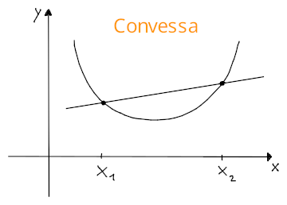
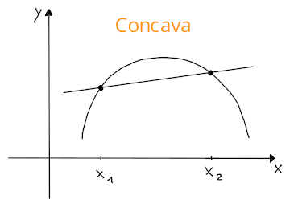
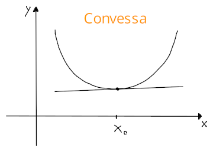
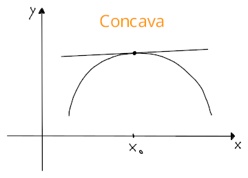

# Convessità, concavità e flessi

## Derivate di ordine superiore

Una funzione $f$ può essere derivata più di una volta:
$$f^{(k)} = (f^{(k-1)})' = \frac{d^k f}{dx^k}$$
dove l'indice $k \in \mathbb{N}$ indica l'**ordine di derivazione**.

## Classi di funzioni derivabili

Una funzione $f$ si dice di classe $C^k$ se le sue derivate **esistono fino** a $f^{(k)}$ e l'ultima è continua, di conseguenza si ha che $f \in C^k(I)$ con:
$$
C^k(I) =
\{f\colon I \to \mathbb{R} | f \text{ derivabile } k \text{ volte e } f^{(k)} \text{ continua}\}
$$

Se $f \in C^0$ allora $f$ si dice **continua**, ma se $f \in C^1$ allora $f$ è **continua**, **differenziabile** e $f'$ è **continua**.

## Convessità e concavità

Una funzione si dice **convessa** se per ogni coppia di punti $x_1, x_2 \in I$, la retta secante su $x_1$ e $x_2$ si trova **al di sopra del grafico** di $f$ e quindi la **concavità è rivolta verso l'alto**:
$$f(x) \leq \frac{f(x_2) - f(x_1)}{x_2 - x_1}(x - x_1) + f(x_1),\; \forall x \in ]x_1, x_2[$$
dove il membro a destra corrisponde all'equazione della retta secante $y = m(x - x_1) + y_1$.

Una funzione si dice **concava** invece, se la retta secante $g$ si trova **al di sotto del grafico** di $f$, e quindi $f(x) \geq g(x), \forall x \in ]x_1, x_2[$ per cui la **concavità è rivolta verso il basso**.

Attraverso $f''$ è possibile determinare la concavità, se:
- $f''(x) \geq 0, \forall x \in I$, allora $f$ è **convessa** in $I$
- $f''(x) \leq 0, \forall x \in I$, allora $f$ è **concava** in $I$

## Convessità e concavità locale e punti di flesso

Una funzione si dice **localmente convessa** in $x_0$ se:
$$\exists \delta > 0 : f(x) \geq f'(x_0)(x - x_0) + f(x_0), \forall x \in B(x_0, \delta)$$
cioè quando le immagini dei punti di un intorno circolare di $x_0$ stanno sopra i punti della tangente in $x_0$.
Al contrario della convessità di $f$ su un intervallo, i punti stanno sopra la retta perchè è tangente di $x_0$ e quindi ha una sola intersezione.

Si dice **localmente concava** in $x_0$ invece, se sono i punti sulla retta ad essere più grandi di $f(x)$ nell'intorno.

Il punto $x_0$ si dice **punto di flesso** per $f$ se esiste $\delta > 0$ tale che $f$ è localmente convessa a sinistra di $x_0$ e localmente concava a destra, o viceversa.

Anche in questo caso, è possibile determinarlo attraverso $f''$, se:
- $f''(x_0) > 0$, allora $f$ è **convessa** in $x_0$
- $f''(x_0) < 0$, allora $f$ è **concava** in $x_0$
- $f''(x_0) = 0$, allora $x_0$ è **punto di flesso**, cioè di cambio di concavità
