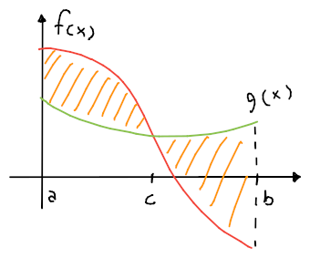

# Integrali definiti

L'integrale **definito**,
$$\int_a^b f(x)dx$$
serve per calcolare l'**area** del trapezoide tra il grafico di $f$, l'asse $x$ e $x = a$ e $x = b$.

L'area può essere [approssimata](https://www.desmos.com/calculator/7ismmr96z2) attraverso dei [plurirettangoli](https://en.wikipedia.org/wiki/Riemann_sum):
- **Plurirettangoli inscritti**:

	Per cui l'area è approssimata dalla somma delle aree dei rettangoli inscritti nel grafico sottostante a $f$:
	$$I \approx s_n = \sum_{i = 1}^n h_i \Delta x$$
	dove $\Delta x = \frac{b - a}{n}$ è la **base** dei rettangoli, mentre $h_i = \underset{x \in I_i}{\min}(f(x))$, con $I_i$ che è l'intervallo sulle $x$ largo $\Delta x$, è l'**altezza** del rettangolo $i$-esimo.

- **Plurirettangoli circoscritti**

	Per cui è approssimata dai rettangoli inscritti:
	$$I \approx S_n = \sum_{i = 1}^n H_i \Delta x$$
	dove $H_i = \underset{x \in I_i}{\max}(f(x))$.

Per il [teorema del confronto](../../04/01/README.md), $\sup(s_n) = \inf(S_n) = I$ e quindi:
$$
\begin{array}{rcccl}
s_n & \leq & I & \leq & S_n \\
& \searrow & \overset{n \to +\infty \Rightarrow \Delta x \to 0}{\downarrow} & \swarrow & \\
&& \int_a^b f(x) dx &&
\end{array}
$$

## Esempio

$$\int_0^3 x + 2 dx = \frac{(5 + 2) \cdot 3}{2}$$
perchè la funzione $f(x) = x + 2$ da $0$ a $3$ forma un trapezio.

Si ha che $\Delta x = \frac{3 - 0}{n} = \frac{3}{n}$ dove $n$ è il numero di _plurirettangoli_ tra $0$ e $3$. \
Ogni _plurirettangolo_ ha intervallo $I_i = [x_{i - 1}, x_i]$, dove $x_i = x_{i-1} + \Delta x = x_0 + i \cdot \Delta x = i \Delta x$.

Quindi la **somma degli integrali superiori** sarà:
$$
\begin{split}
S_n &= \sum_{i = 1}^n \Delta x f(x_i) = \\
&= \sum_{i = 1}^n \frac{3}{n} \left(\frac{3}{n} \cdot i + 2\right) = \\
&= \frac{9}{n^2} \sum_{i = 1}^n i + \frac{6}{n} \sum_{i = 1}^n 1 = \\
&= \frac{9}{n^2} \cdot \frac{n (n+1)}{2} + \frac{6}{n} \cdot n = \frac{9 (n+1)}{2n} + 6
\end{split}
$$

## Teorema della media

Il **teorema della media** dice che, avendo una funzione $f \in C^0 : [a, b] \to \mathbb{R}$, allora:
$$\exists c \in [a, b] : f(c) = \frac{\int_a^b f(x) dx}{b - a}$$
dove $(b - a) \cdot f(c)$ può essere pensato come **base** per **altezza**.

## Teorema fondamentale del calcolo integrale

Se $f\colon [a, b] \to \mathbb{R}$ continua, allora il teorema produce l'area **con segno** della funzione $f$:
$$\int_a^b f(x) dx = F(b) - F(a)$$

Per esempio, $\int_0^2 x^2 dx = \left[\frac{x^3}{3}\right]_0^2 = \frac{8}{3}$ dato che $F(x) = \int x^2 dx - c= \frac{x^3}{3}$.

Oltre a rispettare le proprietà degli integrali indefiniti, rispetta anche la proprietà per cui:
$$\left|\int_a^b f(x) dx\right| \leq \int_a^b |f(x)| dx$$

## Area tra due funzioni

In generale, l'area che tra due funzioni $f(x)$ e $g(x)$ è ricavabile con:
$$\int_a^b |f(x) - g(x)| dx$$

Per esempio, l'area tra le funzioni

è ricavabile con:
$$\int_a^b |f(x) - g(x)| dx = \int_a^c f(x) - g(x) dx + \int_c^b g(x) - f(x) dx$$
