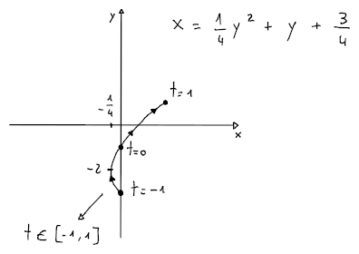

# Curve parametriche

Una curva è una **funzione vettoriale** che associa un **parametro** $t$ ad un punto nel piano $m$-dimensionale:
$$
\begin{split}
r\colon &I \subseteq \mathbb{R} \to \mathbb{R}^m \\
&t \mapsto (r_1(t), r_2(t), ..., r_m(t))
\end{split}
$$

Per disegnare la curva va usato il **sostegno alla curva parametrica** $\gamma$, che corrisponde al grafico senza $t$:
$$
\gamma(r) = r(I) = \mathrm{Im}(r) \subset \mathrm{Codom}(r)
$$
infatti, se $r(t) \in \mathbb{R}^2$, il **sostegno** $\gamma(r) \subset \mathbb{R}^2$, mentre il [grafico](../../ct0432/03/README.md#grafico) $G(r) \subset \mathbb{R}^3$ perchè anche $t$ venga tracciata.

Per esempio, se $r(t) = (t^2 + t, 2t - 1)$ e $-1 \leq t \leq 1$:

si ottiene un'**arco di curva** di una _parabola capovolta_, perchè $t$ appartiene ad un **intervallo** $I \neq \mathbb{R}$.

Altri esempi includono:
- $r(\theta) = (r\cos(\theta) + x_0, r\sin(\theta) + y_0)$, cioè la circonferenza $(x - x_0)^2 + (y - y_0)^2 = r^2$.
- $r(\theta) = (a\cos(\theta) + x_0, b\sin(\theta) + y_0)$, cioè l'ellissi $\frac{(x - x_0)^2}{a^2} + \frac{(y - y_0)^2}{b^2} = 1$
- $r(t) = p + v(t - t_0)$, cioè la [retta](../../ct0435/03/README.md#retta) che passa per $p$ al tempo $t_0$ in direzione del vettore $v$

Per esempio, se $r(t) = (t^2, t)$, la _tangente_ su $t_0 = 1$ sarà $s(t) = (1, 1) + (2, 1)(t - 1) = (2t - 1, t)$.
