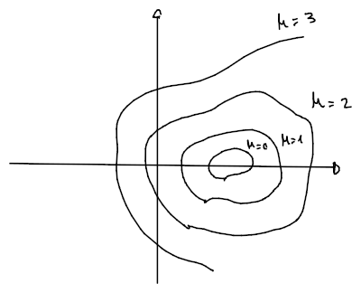

# Funzioni a più variabili

Una funzione a più variabili è detta tale se:
$$
\begin{split}
f\colon A \subseteq \mathbb{R}^n &\to \mathbb{R} \\
\vec{x} = (x_1, ..., x_n) &\mapsto z = f(\vec{x}) = f(x_1, ..., x_n)
\end{split}
$$
per cui il grafico $G(f) = \{(\vec{x}, z) \in \mathbb{R}^n \times \mathbb{R} : \vec{x} \in \mathrm{Dom}(f) \land z = f(\vec{x})\}$.

## Insieme di livello

L'**insieme di livello** associato a $k \in \mathbb{R}$ di una funzione $f$ è:
$$
\Lambda_k = \{\vec{x} \in \mathrm{Dom}(f) : f(\vec{x}) = k\}
$$
cioè l'insieme di tutti i punti $\vec{x}$ del dominio di $f$ che **si trovano ad altezza** $k$.

Chiamiamo invece **sezione verticale**, una sezione come l'_insieme di livello_ ma parallelo all'asse $z$.

Per esempio, se $f(x, y) = x^2 + y^2$ e il livello è $k \in \mathbb{R}$:
$$
\Lambda_k = \begin{cases}
\emptyset & \text{se } k < 0 \\
\{(0, 0)\} & \text{se } k = 0 \\
\{(x, y) \in \mathbb{R}^2 : x^2 + y^2 = k\} & \text{se } k > 0
\end{cases}
$$
che nel caso $k > 0$, risulta essere un _cerchio_ con raggio $\sqrt{k}$.

Come _sezioni verticali_ invece:
- $f(0, y) = y^2$: una parabola parallela al piano $yz$ come intersezione con il piano $x = 0$
- $f(x, 0) = x^2$: parallela al piano $xz$ come intersezione con il piano $y = 0$
