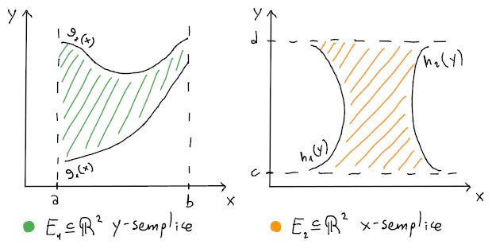

# Domini non rettangolari

L'integrale può essere esteso su un dominio $E$ **non rettangolare** (che esclude il [teorema di Fubini](../README.md)),

di tipo:
- $y$**-semplice**, se $E_1 = \{(x, y) \in \mathbb{R}^2 : x \in [a, b] \land g_1(x) \leq y \leq g_2(x)\}$ allora:
$$
\iint_{E_1} f(x, y) dx dy = \int_a^b \left(\int_{g_1(x)}^{g_2(x)} f(x, y) dy\right) dx
$$
- $x$**-semplice**, se $E_2 = \{(x, y) \in \mathbb{R}^2 : y \in [c, d] \land h_1(y) \leq x \leq h_2(y)\}$
$$
\iint_{E_2} f(x, y) dx dy = \int_c^d \left(\int_{h_1(y)}^{h_2(y)} f(x, y) dx\right) dy
$$
- **Semplice**, se $E = E_1 \cap E_2$
- **Regolare**, se unione di insiemi _semplici_

Per esempio, se $f(x, y) = 2x$ e il dominio:
$$E = \left\{(x, y) \in \mathbb{R}^2 : x \geq 0 \land y \geq \frac{\sqrt{3}}{2} \land \frac{x^2}{4} + y^2 \leq 1\right\}$$
allora l'area andrà calcolata tra:
- $\frac{\sqrt{3}}{2}$ e la _frontiera_ $y = \sqrt{1 - \frac{x^2}{4}} = \frac{1}{2}\sqrt{4 - x^2}$ dell'ellissi $\frac{x^2}{4} + y^2 = 1$, per le $y$ positive
- $0$ e $1$ per le $x$, perchè l'ellissi decresce nel primo quadrante e si interseca con $y =\frac{\sqrt{3}}{2}$ su $x = 1 \geq 0$

di conseguenza:
$$
\begin{split}
\int_0^1 \left(\int_{\frac{\sqrt{3}}{2}}^{\frac{1}{2}\sqrt{4 - x^2}} 2x dy\right) dx &=
\int_0^1 [2xy]_{\frac{\sqrt{3}}{2}}^{\frac{1}{2}\sqrt{4 - x^2}} dx =
\int_0^1 x\sqrt{4 - x^2} - \sqrt{3}x dx = \\
&= \left[-\frac{1}{3}\left(4 - x^2\right)^{\frac{3}{2}} - \frac{\sqrt{3}}{2}x^2\right]_0^1 =
\frac{8}{3} - \frac{\sqrt{3}}{2} - \sqrt{3}
\end{split}
$$
