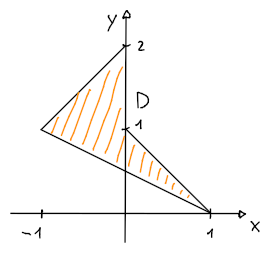

# Baricentro

All'interno di un dominio $D \subset \mathbb{R}^2$, il **baricentro** è il _punto medio_ di tutte le $x$ e di tutte le $y$ del dominio:
$$
(x_C, y_C) = \left(\frac{\iint_D x\ dx dy}{A_D},\; \frac{\iint_D y\ dx dy}{A_D}\right)
$$
dove $A_D$ è l'_area del dominio_:
$$
A_D = \iint_D dx dy
$$

La funzione $f(x, y)$ non è quindi necessaria per il calcolo del _baricentro_, infatti in un _dominio rettangolare_ è [sempre al centro](https://www.desmos.com/calculator/57xbl3xwsh), indipendentemente dall'andamento di $f$.

Per esempio, se $D$ corrisponde a:

allora:
$$
\begin{split}
A_D &= \int_{-1}^0 \int_{\frac{1 - x}{2}}^{x + 2} 1\ dy dx + \int_0^1 \int_{\frac{1 - x}{2}}^{1 - x} 1\ dy dx = 1 \\
(x_C, y_C) &= \left(
\frac{\int_{-1}^0 \int_{\frac{1 - x}{2}}^{x + 2} x\ dy dx + \int_0^1 \int_{\frac{1 - x}{2}}^{1 - x} x\ dy dx}{A_D},
\frac{\int_{-1}^0 \int_{\frac{1 - x}{2}}^{x + 2} y\ dy dx + \int_0^1 \int_{\frac{1 - x}{2}}^{1 - x} y\ dy dx}{A_D}
\right) = \left(-\frac{1}{6}, 1\right)
\end{split}
$$
