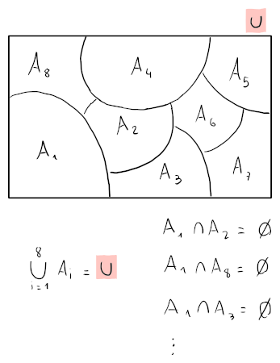

# Insiemi

Parte dell'argomento è già stato trattato nella parte di [Calcolo 1](../../ct0432/01/README.md).

Quando un insieme è composto da un solo elemento, e quindi ha cardinalità $1$, viene chiamato **singleton**.

## Insiemi delle parti

Un insieme delle parti di $A$, o $P(A)$ è **l'insieme di tutti i sottoinsiemi** di $A$.

La cardinalità di questo insieme di insiemi sarà $|P(A)| = 2^{|A|}$.

Per esempio, se $A = \{0, 1\}$ allora $P(A) = \{\emptyset, \{0\}, \{1\}, \{0, 1\}\}$ e $|P(A)| = 2^2$.

## Coppie

Una coppia è una **tupla** ordinata di due elementi, cioè una collezione di oggetti il cui ordine è importante e che è diverso da un insieme (e.g. $(1, 2) \neq \{1, 2\}$).

Le _tuple_ con $n$ elementi vengono chiamate **ennuple** (e.g. $(1, 2, 3, ..., n)$).

Gli insiemi di coppie sono degli insiemi che come elementi contengono delle coppie. \
Un esempio è il piano cartesiano $\mathbb{R}^2$, che contiene l'insieme di coppie $(x, y)$.

## Partizioni

Una famiglia di insiemi $A_i$ formano una **partizione** di $U$, se:
1. $A_i \subset U$, quindi sono tutti sottoinsiemi di $U$
2. $A_i \cap A_k = \emptyset$, per cui non hanno alcuna intersezione tra di loro

## Relazioni

Una **relazione** $R$ tra due insiemi $A$ e $B$ è un sottoinsieme del prodotto cartesiano: $R \subset A \times B$.

Il sottoinsieme conterrà delle coppie $(a, b), a \in A \land b \in B$ che sono messe in relazione da $R$.

Per esempio, con $A = B = \{x | x \text{ è una persona}\}$, allora la relazione $R \subset A^2$ corrisponderà a $R = \{(x, y) | x \text{ è amico di } y\}$, per cui $x$ è in relazione con $y$ secondo $R$.
