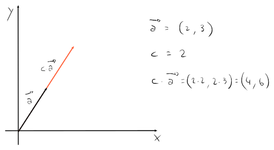

# Operazioni

- **Addizione**:
	$$a + b = (a_1, a_2) + (b_1, b_2) = (a_1 + b_1, a_2 + b_2)$$

	

- **Prodotto per uno scalare** $c \in \mathbb{R}$:
	$$c \cdot a = c \cdot (a_1, a_2) = (c \cdot a_1, c \cdot a_2)$$

	

- **Norma**, o _modulo_:
	$$||v|| = \sqrt{v \cdot v} = \sqrt{(v_1)^2 + (v_2)^2}$$
	dove $v \cdot v$ corrisponde al **prodotto scalare** tra $v$ e se stesso, cioè a $||v||^2$.

- **Prodotto scalare**:
	$$v \cdot w = (||v|| \cdot \cos(\alpha)) \cdot ||w||$$
	dove $\alpha$ corrisponde all'angolo tra i due vettori $v$ e $w$.

	La parte $||v||\cos(\alpha)$ si può pensare come la **proiezione** di $v$ su $w$, che poi servirà come scalare per $||w||$, ridimensionando quindi la lunghezza di $w$ secondo la lunghezza della proiezione.

	

	Un modo _più veloce_ per moltiplicare due vettori però, senza conoscere $\alpha$, è:
	$$a \cdot b = (a_1, a_2) \cdot (b_1, b_2) = a_1b_1 + a_2b_2$$

	Della moltiplicazione valgono le seguenti proprietà:
	- $a \cdot b = b \cdot a$
	- $a \cdot (b + c) = a \cdot b + a \cdot c$
	- $(c \cdot a) \cdot b = c \cdot (a \cdot b)$, con $c \in \mathbb{R}$
	- Se $a = 0$ allora $a \cdot a = 0$, altrimenti $a \cdot a > 0$

Tutte le operazioni possono essere generalizzate su $n$ dimensioni. \
Per esempio, $||v|| = ||\sqrt{(\sum_{i = 1}^n (v_i)^2)}||$, su $\mathbb{R}^n$.

## Vettore unità

Un vettore unità $\tilde v$, è un vettore la cui **norma** è uguale ad $1$.

Per ottenere il vettore unità su un vettore $v$, basta ridimensionare la norma in modo che sia $1$dividendo per il valore scalare $||v||$:
$$\tilde v = \frac{v}{||v||}$$

Per esempio, se $v = (2, 3)$ allora $\tilde v = \frac{v}{\sqrt{13}} = \left(\frac{2}{\sqrt{13}}, \frac{3}{\sqrt{13}}\right)$.

## Distanza tra due punti

Per trovare la distanza tra due punti, basta:
$$\mathrm{dist}(A, B) = ||\overrightarrow{AB}|| = ||B - A|| = \sqrt{(x_B - x_A)^2 + (y_B - y_A)^2}$$

Per esempio, se $C = (-2, 1)$ e $D = (2, 1)$, $\overrightarrow{CD} = (x_D - x_C, y_D - y_C) = (4, 0)$, quindi $||\overrightarrow{CD}|| = 4$.
