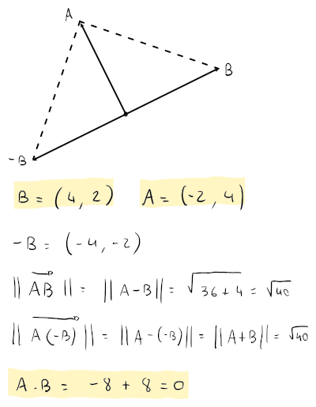

# Perpendicolari e allineati

Due vettori si dicono **allineati**, se con l'angolo $\alpha$ tra i due vettori si ottiene che:
$$\cos(\alpha) = \pm 1$$
cioè che $\alpha = k \pi$, con $k \in \mathbb{N}$.

Invece, $A$ e $B$ si dicono **perpendicolari** o **ortogonali**, se
$$A \cdot B = 0$$
che si verifica quando
$$||A - B||^2 = ||A + B||^2$$
ovvero quando la distanza tra i punti $A$ e $B$ (cioè $||\overrightarrow{AB}||$) e la distanza tra $A$ e $-B$ (cioè $||\overrightarrow{A(-B)}||$, dove $-B$ è il vettore capovolto (e quindi allineato a $B$)) si equivalgono.

Un altro modo in cui si verifica, è quando in $A \cdot B = ||A|| \cdot \cos(\alpha) \cdot ||B||$, il $\cos(\alpha) = 0$, cioè quando $\alpha = \pm \frac{\pi}{2} = \pm 90^\circ$.
