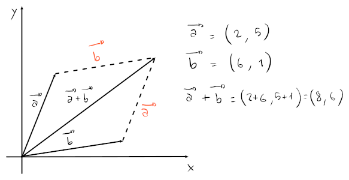

# Vettori

Il più semplice vettore è un **vettore applicato** $\overrightarrow{PQ}$, anche chiamato **segmento orientato**, che parte da un _punto iniziale_ $P$ ed arriva ad un _punto finale_ $Q$.

L'indicazione dell'origine del vettore lo rende **orientato**, per cui $\overrightarrow{PQ} \neq \overrightarrow{QP}$.

Un **punto**, viene quindi espresso con le lettere maiuscole e come una **coppia** (tuple da due componenti) di numeri (e.g. $A = (1, 2)$).

Un vettore generico $v$ **applicato nell'origine** invece, viene rappresentato come la coppia di valori $(x, y)$ in due dimensioni (quindi $\mathbb{R}^2$).
Con l'aumento di dimensioni, aumentano anche i **componenti** del vettore:
$$v = (x_1, x_2, ..., x_n) \text{ su } \mathbb{R}^n$$

## Coordinate nulle

La coordinata nulla è una coordinata $O$, per cui vale
$$A + O = A$$

Nel caso del _piano cartesiano_ $\mathbb{R}^2$, il punto $O$ sarà l'origine $(0, 0)$.

## Scalare

Un valore $c$ è uno **scalare** quando $c \in \mathbb{R}$.
Si chiama in questo modo perchè se si moltiplica un vettore per uno scalare si ottiene un **vettore ridimensionato**.

## Operazioni

- **Addizione**:
	$$a + b = (a_1, a_2) + (b_1, b_2) = (a_1 + b_1, a_2 + b_2)$$

	

- **Prodotto per uno scalare** $c \in \mathbb{R}$:
	$$c \cdot a = c \cdot (a_1, a_2) = (c \cdot a_1, c \cdot a_2)$$

	

- **Norma**, o _modulo_:
	$$||v|| = \sqrt{v \cdot v} = \sqrt{(v_1)^2 + (v_2)^2}$$
	dove $v \cdot v$ corrisponde al **prodotto scalare** tra $v$ e se stesso, cioè a $||v||^2$.

- **Prodotto scalare**:
	$$v \cdot w = (||v|| \cdot \cos(\alpha)) \cdot ||w||$$
	dove $\alpha$ corrisponde all'angolo tra i due vettori $v$ e $w$.

	La parte $||v||\cos(\alpha)$ si può pensare come la **proiezione** di $v$ su $w$, che poi servirà come scalare per $||w||$, ridimensionando quindi la lunghezza di $w$ secondo la lunghezza della proiezione.

	

	Un modo _più veloce_ per moltiplicare due vettori però, senza conoscere $\alpha$, è:
	$$a \cdot b = (a_1, a_2) \cdot (b_1, b_2) = a_1b_1 + a_2b_2$$

	Della moltiplicazione valgono le seguenti proprietà:
	- $a \cdot b = b \cdot a$
	- $a \cdot (b + c) = a \cdot b + a \cdot c$
	- $(c \cdot a) \cdot b = c \cdot (a \cdot b)$, con $c \in \mathbb{R}$
	- Se $a = 0$ allora $a \cdot a = 0$, altrimenti $a \cdot a > 0$

Tutte le operazioni possono essere generalizzate su $n$ dimensioni. \
Per esempio, $||v|| = ||\sqrt{(\sum_{i = 1}^n (v_i)^2)}||$, su $\mathbb{R}^n$.

## Vettore unità

Un vettore unità $\tilde v$, è un vettore la cui **norma** è uguale ad $1$.

Per ottenere il vettore unità su un vettore $v$, basta ridimensionare la norma in modo che sia $1$dividendo per il valore scalare $||v||$:
$$\tilde v = \frac{v}{||v||}$$

Per esempio, se $v = (2, 3)$ allora $\tilde v = \frac{v}{\sqrt{13}} = \left(\frac{2}{\sqrt{13}}, \frac{3}{\sqrt{13}}\right)$.

## Distanza tra due punti

Per trovare la distanza tra due punti, basta:
$$\mathrm{dist}(A, B) = ||\overrightarrow{AB}|| = ||B - A|| = \sqrt{(x_B - x_A)^2 + (y_B - y_A)^2}$$

Per esempio, se $C = (-2, 1)$ e $D = (2, 1)$, $\overrightarrow{CD} = (x_D - x_C, y_D - y_C) = (4, 0)$, quindi $||\overrightarrow{CD}|| = 4$.

## Vettori perpendicolari e allineati

Due vettori si dicono **allineati**, se con l'angolo $\alpha$ tra i due vettori si ottiene che:
$$\cos(\alpha) = \pm 1$$
cioè che $\alpha = k \pi$, con $k \in \mathbb{N}$.

Invece, $A$ e $B$ si dicono **perpendicolari** o **ortogonali**, se
$$A \cdot B = 0$$
che si verifica quando
$$||A - B||^2 = ||A + B||^2$$
ovvero quando la distanza tra i punti $A$ e $B$ (cioè $||\overrightarrow{AB}||$) e la distanza tra $A$ e $-B$ (cioè $||\overrightarrow{A(-B)}||$, dove $-B$ è il vettore capovolto (e quindi allineato a $B$)) si equivalgono.

Un altro modo in cui si verifica, è quando in $A \cdot B = ||A|| \cdot \cos(\alpha) \cdot ||B||$, il $\cos(\alpha) = 0$, cioè quando $\alpha = \pm \frac{\pi}{2} = \pm 90^\circ$.

## Proiezione

Per ricavare la proiezione di un vettore $A$ su $B$, basta **ridimensionare** $B$, in modo che la sua **norma sia uguale alla proiezione** di $A$ su $B$.

Chiamiamo, quindi, $c$ il valore scalare che ridimensionerà $B$ come proiezione di $A$ su $B$:
$$||cB|| = c||B|| = ||A|| \cdot \cos(\alpha)$$

Sappiamo che
$$A \cdot B = ||A|| \cdot \cos(\alpha) \cdot ||B|| \Rightarrow \frac{A \cdot B}{||B||} = ||A|| \cdot \cos(\alpha)$$
di conseguenza, è possibile sostituire nel valore di $c||B||$:
$$c||B|| = \frac{A \cdot B}{||B||} \Rightarrow c = \frac{A \cdot B}{||B||^2} = \frac{A \cdot B}{B \cdot B}$$

Un'alternativa è trovare il vettore che va da $cB$ a $A$, cioè $\overrightarrow{(cB)A} = A - cB$.
Questo lo si può ottenere sfruttando la proprietà della perpendicolarità:
$$(A - cB) \cdot B = 0 \Rightarrow A \cdot B - cB \cdot B = 0 \Rightarrow c = \frac{A \cdot B}{B \cdot B}$$
