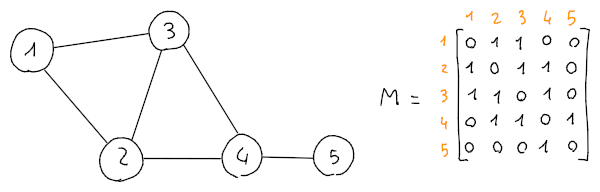

# Grafi

I grafi sono fatti di **vertici** (o nodi), indicati con $V$, e **archi**, indicati con $E$:
$$G = (V, E)$$
con
$$V = \{v_1, v_2, ..., v_n\},\, E = \{(v_1, v_2), ...\} \subseteq V \times V$$
per cui ogni coppia in $E$ indica un collegamento tra due vertici e anche la direzione, infatti perchè l'arco sia bidirezionale $(v_1, v_2) \in E \land (v_2, v_1) \in E$.

## Matrice di adiacenza

La **matrice di adiacenza** è una matrice che identifica gli archi tra ogni nodo, inclusa la loro direzione, quindi:
$$M = \begin{cases}1 & \text{se } (v_i, v_j) \in E \\ 0 & \text{altrimenti}\end{cases}$$

Per esempio,

dove la matrice $M$ è di dimensioni $5 \times 5$ perchè il numero di vertici $|V| = 5$.

Se si effettua la somma degli $1$ sulla riga $r$ della matrice, per esempio $r = 1$, si ottiene il **grado del nodo** $v_r$:
$$\sum_{j=1}^n M_{rj} = \sum_{j=1}^5 M_{1j} = 2$$

Mentre,
$$(M^k)_{ij}$$
indica il numero di cammini lunghi $k$ dal vertice $i$ al vertice $j$.

Per esempio, se se si vuole trovare quanti cammini lunghi $2$ ci sono dal nodo $1$ al $4$:
$$
M^2 =
\begin{bmatrix}
2 & 1 & 1 & 2 & 0 \\
1 & 3 & 2 & 1 & 1 \\
1 & 2 & 3 & 1 & 1 \\
2 & 1 & 1 & 3 & 0 \\
0 & 1 & 1 & 0 & 1
\end{bmatrix} \Rightarrow
(M^2)_{14} = 2
$$
