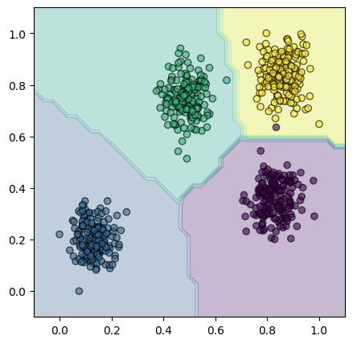

# k-NN

```py
from sklearn.neighbors import KNeighborsClassifier
model = KNeighborsClassifier()
model.fit(X, y)
```

L'algoritmo di **$k$-nearest neighbors** prevede la classe di appartenenza semplicemente scegliendo quella **più frequente** tra i $k$ _feature vector_ (i.e. input) più vicini, secondo la loro [distanza euclidea](https://en.wikipedia.org/wiki/Euclidean_distance).

Si vuole quindi **bilanciare** $k$: **non troppo piccolo** per evitare sensibilità al rumore, e **non troppo grande** per evitare costi computazionali elevati.
È anche possibile dare un **peso alla distanza** con $w = \frac{1}{d^2}$.

Uno **svantaggio** della _distanza euclidea_ è che assume che ogni _feature_ (i.e. elemento del vettore) abbia lo stesso peso.
Questo si può aggirare **scalando** ogni colonna $j$ in modo che il suo intervallo
$$
\left[\min_i A_{ij}, \max_i A_{ij}\right] \to [0, 1]
$$
con `StandardScaler` o `MinMaxScaling`, che sono però entrambi sensibili agli _outliers_.

Per esempio, usando dati casuali
```python
from sklearn.datasets import make_blobs
from sklearn.model_selection import train_test_split
from sklearn.preprocessing import MinMaxScaler
from sklearn.neighbors import KNeighborsClassifier

X, y = make_blobs(
  n_samples=1000, centers=4,
  random_state=12345
)
X_train, X_test, y_train, y_test = train_test_split(
  X, y,
  test_size=0.33,
  random_state=42
)

scaler = MinMaxScaler()
scaler.fit(X_train)

model = KNeighborsClassifier(n_neighbors=10)
model.fit(scaler.transform(X_train), y_train)
y_pred = model.predict(scaler.transform(X_test))
```
si ottiene la seguente classificazione, con le `X` normalizzate in $[0, 1]$:


