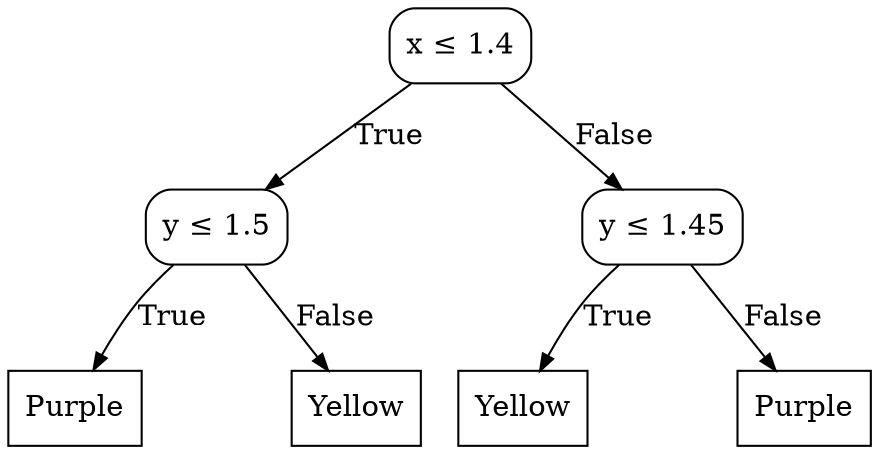

# Decision tree

```py
from sklearn.tree import DecisionTreeClassifier
model = DecisionTreeClassifier()
model.fit(X, y)
```

Attraverso gli _alberi decisionali_ è possibile **partizionare** il dominio dei _feature vector_ in base ai valori delle singole _feature_ (i.e. componenti), e a dei **threshold** che rappresentano il confine di suddivisione.

Per esempio, dallo spazio con _feature vector_ $(x, y)$


si può ricavare un albero simile a:



Un algoritmo per la costruzione dell'albero è l'**algoritmo di Hunt** ricorsivo, che prende un _dataset_ $\mathcal{D}$:
```c
build_tree(D)
  best_split, best_gain = null
  for each feature f
    for each threshold t
      gain = split_goodness(f, t)  // Riduzione dell'errore partizionando per (f <= t)
      if gain >= best_gain
        best_gain = gain
        best_split = (f, t)

  if best_gain = 0 or other_stopping_criteria
    μ = best_prediction(D)  // Media/moda delle y di D per regressione/classificazione
    return Leaf(μ)

  (f, t) = best_split
  L = build_tree(filter(D, x : x[f] <= t))
  R = build_tree(filter(D, x : x[f] > t))
  return Node(L, R)
```

## Miglior previsione

Per la **classificazione**, la `best_prediction(D)` è la moda delle $y$ di $(x, y) \in \mathcal{D}$, cioè il **label più frequente**:
$$
\mu = \argmin_{\mu'} \mathrm{Error}(\mathcal{D}, \mu') =
\argmin_{\mu'} \frac{1}{|\mathcal{D}|} \sum_{(x, y) \in \mathcal{D}}
\begin{cases}
0 & \text{se } \mu' = y \\
1 & \text{altrimenti}
\end{cases}
$$
mentre per la **regressione** è la media di tutti i label, su cui l'_MSE_ è l'**errore quadratico medio**:
$$
\mu = \argmin_{\mu'} \mathrm{MSE}(\mathcal{D}, \mu') =
\argmin_{\mu'} \frac{1}{|\mathcal{D}|} \sum_{(x, y) \in \mathcal{D}} (\mu' - y)^2 =
\frac{1}{|\mathcal{D}|} \sum_{(x, y) \in \mathcal{D}} y
$$
e per semplicità, d'ora in poi si definisce $\mathrm{Error}(\mathcal{D})$ come l'errore della miglior previsione $\mu$ di $\mathcal{D}$.

## Guadagno del taglio

La **qualità del taglio** $(f, t)$ è dato dal **guadagno** dell'errore che si ha tagliando $\mathcal{D}$ rispetto a non tagliare:
$$
\mathrm{Gain}((f, t), \mathcal{D}) = \mathrm{Error}(\mathcal{D}) -
\left(
\frac{|\mathcal{D}_L|}{|\mathcal{D}|} \mathrm{Error}(\mathcal{D}_L) +
\frac{|\mathcal{D}_R|}{|\mathcal{D}|} \mathrm{Error}(\mathcal{D}_R)
\right)
$$
o più in generale, quando una serie di tagli su $\mathcal{D}$ generano $k$ partizioni $\mathcal{D}_1, ..., \mathcal{D}_k$:
$$
\mathrm{Gain}((\mathcal{D}_1, ..., \mathcal{D}_k), \mathcal{D}) = \mathrm{Error(D)} - \sum_{i=1}^k \frac{|\mathcal{D}_i|}{|\mathcal{D}|} \mathrm{Error}(\mathcal{D}_i)
$$

## Impurità

L'errore è una delle seguenti **approssimazioni di impurità**, con $p_i$ che è la frequenza del label $l_i$ di $\mathcal{D}$:
- **Classificazione**: $\mathrm{Error}(\mathcal{D}) = 1 - \max\limits_i p_i$
- **Information gain**: $\mathrm{Error}(\mathcal{D}) = -\sum\limits_i p_i \log_2 p_i$, con cui $\mathrm{Gain}$ diventa $\mathrm{InfoGain}$
- **Gini index**: $\mathrm{Error}(\mathcal{D}) = \mathrm{Gini}(\mathcal{D}) = 1 - \sum\limits_i p_i^2$

Siccome l'_information gain_ favorisce molti partizioni piccole, esiste anche il **gain ratio** che normalizza il _gain_:
$$
\mathrm{GainRatio}((\mathcal{D}_1, ..., \mathcal{D}_k), \mathcal{D}) = \frac{\mathrm{InfoGain}((\mathcal{D}_1, ..., \mathcal{D}_k), \mathcal{D})}{\mathrm{SplitInfo}(\mathcal{D}_1, ..., \mathcal{D}_k)}
$$
dove $\mathrm{SplitInfo}(\mathcal{D}_1, ..., \mathcal{D}_k) = -\sum\limits_{i=1}^k \frac{|\mathcal{D}_i|}{|\mathcal{D}|} \log \frac{|\mathcal{D}_i|}{|\mathcal{D}|}$.

## Overfitting

Regolare gli **iperparametri** (e.g. massimo numero di foglie) può causare l'**overfitting** del modello, che causa un'esagerata accuratezza sul _dataset_ di _training_ peggiorando di conseguenza quella di _test_.

Una soluzione consiste nel dividere il _training_ del _dataset_ anche in **validation** con cui è possibile trovare la miglior configurazione del modello, senza che si adatti troppo al _dataset_ imparato.

Un'altra soluzione è il **pruning**, che tenta di semplificare il modello con:
- **Pre-pruning**: ferma la crescita dell'albero con delle _stopping criteria_
- **Post-pruning**: dopo la crescita sostituisce i rami con la loro foglia più frequente, se l'errore diminuisce

Inoltre, si può ridurre l'_overfitting_ considerando la complessità del modello sull'**errore generalizzato**:
$$
\begin{split}
\mathrm{Error}_{\mathrm{gen}}(\mathcal{D}, \mathcal{M}) &= \mathrm{Error}(\mathcal{D}, \mathcal{M}) + \alpha \cdot \mathrm{Complexity}(\mathcal{M}) = \\
&= \frac{1}{|\mathcal{D}|} \sum_{(x, y) \in \mathcal{D}} (\mathcal{M}(x) - y)^2 + \alpha \cdot \frac{|L(\mathcal{M})|}{|\mathcal{D}|}
\end{split}
$$
dove $|L(\mathcal{M})|$ è il numero di foglie e $\alpha$ è un nuovo _iperparametro_.
