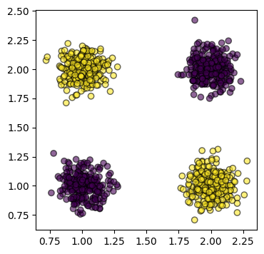

# Decision tree


Attraverso gli _alberi decisionali_ è possibile **partizionare** il dominio dei _feature vector_ in base ai valori delle singole _feature_ (i.e. componenti), e a dei **threshold** che rappresentano il confine di suddivisione.

Per esempio, dallo spazio con _feature vector_ $(x, y)$



si può ricavare un albero simile a:


## Classificazione

Un algoritmo per la costruzione dell'albero è l'**algoritmo di Hunt** ricorsivo, che prende un _dataset_ $\mathcal{D}$:
```c
build_tree(D)
	best_split, best_gain = null
	for each feature f
		for each threshold t
			gain = split_goodness(f, t)	// Riduzione dell'errore partizionando per (f <= t)
			if gain >= best_gain
				best_gain = gain
				best_split = (f, t)

	if best_gain = 0 or other_stopping_criterion
		μ = best_prediction(D)	// Media/moda delle y di D per regressione/classificazione
		return Leaf(μ)

	f, t = best_split
	L = build_tree(filter(D, x : x[f] <= t))
	R = build_tree(filter(D, x : x[f] > t))
	return Node(L, R)
```

### Foglie

La `best_prediction(D)` è definita come la moda delle $y$ di $(x, y) \in \mathcal{D}$, ovvero il **label più frequente**:
$$
\argmin_\mu \mathrm{Error}(\mathcal{D}, \mu) =
\argmin_\mu \frac{1}{|\mathcal{D}|} \sum_{(x, y) \in \mathcal{D}}
\begin{cases}
0 & \text{se } \mu = y \\
1 & \text{altrimenti}
\end{cases}
$$

Per semplicità, d'ora in poi si definisce $\mathrm{Error}(\mathcal{D})$ come l'errore della miglior previsione $\mu$ di $\mathcal{D}$.

### Nodi interni

La qualità del taglio $(f, t)$ è dato dal **guadagno** dell'errore che si ha tagliando $\mathcal{D}$ rispetto a non tagliare:
$$
\mathrm{Gain}((f, t), \mathcal{D}) = \mathrm{Error}(\mathcal{D}) -
\left(
\frac{|\mathcal{D}_L|}{|\mathcal{D}|} \mathrm{Error}(\mathcal{D}_L) +
\frac{|\mathcal{D}_R|}{|\mathcal{D}|} \mathrm{Error}(\mathcal{D}_R)
\right)
$$
