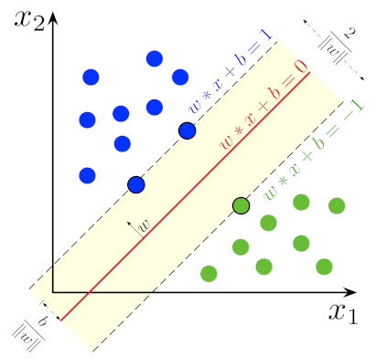
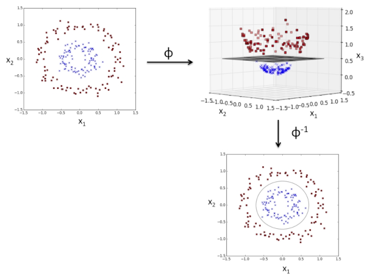

# Regressione lineare

```py
from sklearn.linear_model import LinearRegression
model = LinearRegression()
model.fit(X, y)
```

La **regressione lineare** consiste nell'adattare la retta $y = wx + b$ (o modelli di grado superiore) ai dati o alla loro trasformazione, esplorando i coefficienti in modo da [minimizzare l'errore](../../../ct0427/05/01/README.md).

## Regressione logistica

```py
from sklearn.linear_model import LogisticRegression
model = LogisticRegression()
model.fit(X, y)
```

Permette la **classificazione binaria** assegnando una probabilità alle classi $0$ e $1$, che verrà poi arrotondata all'intero più vicino per effettuare la previsione. L'intervallo $(0, 1)$ si ottiene con la **sigmoid**:
$$
P(y = 1 \mid X = x) = \frac{1}{1 + e^{-(wx + b)}}
$$
da cui si ricava che è una _regressione lineare_ sulle **log-odds**, ovvero il logaritmo delle _odds_ $\frac{P(y = 1 \mid X = x)}{P(y = 0 \mid X = x)}$:
$$
\ln \frac{P(y = 1 \mid X = x)}{P(y = 0 \mid X = x)} = wx + b
$$

Inoltre, questo tipo di apprendimento è applicabile solamente a dati che sono **separabili linearmente**.

## Support vector machine

Un **SVM** è un modello di **classificazione** apprende un **confine di decisione** cercando un iperpiano che separi le classi e massimizzi il **margine**, cioè la distanza tra le istanze di classi opposte più vicine al confine.

La dimensione del _margine_ è determinata dai **support vector**, ovvero le istanze più vicine di ciascuna classe, e più piccola risulta più grande è il **rischio di misclassificazione**.

### Lineare

```py
from sklearn.svm import LinearSVC
model = LinearSVC()
model.fit(X, y)
```

Avendo un _dataset_ da $n$ feature $x \in \mathbb{R}^p$, la versione **lineare** cerca quei pesi $w \in \mathbb{R}^p$ e bias $b \in \mathbb{R}$ tali che:
- **Minimizzano** $\frac{1}{2}\|w\|^2 + C\sum_{i=1}^n \xi_i$
- **Rispettino** il vincolo $y_i(wx_i + b) \geq 1 - \xi_i$ per ogni $i$-esima istanza del _dataset_ con label $y_i \in \{-1, 1\}$

Quando $C = 0$ e $\xi_i = 0, \forall i$ il _margine_ è detto **hard-margin** perchè non accetta classificazioni errate, mentre con altri valori positivi è detto **soft-margin** perchè è meno suscettibile a _dataset_ non separabili linearmente.

Per esempio, usando un _hard-margin_ in $\mathbb{R}^2$:



### Non lineare

```py
from sklearn.svm import SVC
model = SVC()
model.fit(X, y)
```

Attraverso una funzione **kernel** il modello **non lineare** permette di mappare le feature su dimensioni superiori, per poterle separare linearmente con un iperpiano.

Per esempio, dato il _kernel_ $\phi(x, y) = (x, y, x^2 + y^2)$:



## $k$-fold cross validation

La singola scelta del [validation](../02/README.md#overfitting) dal _dataset_ può portare a _iperparametri_ distorti, quindi è possibile suddividere il _training_ anche in _validation_ in **$k$ modi diversi**, ricavandone un'accuratezza media più precisa.

Questo però comporta un costo computazionale elevato, dato che è necessario effettuare il training $k$ volte.
