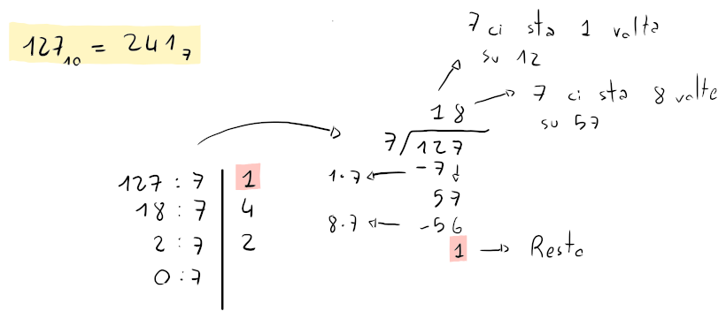
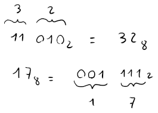
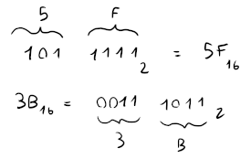

# Conversioni

## Base 10

Per le conversioni in base 10, basta semplicemente moltiplicare le crife per la base elevata alla posizione della cifra, quindi $c \cdot b^p$.

Per esempio, $122_3 = 1 \cdot 3^2 + 2 \cdot 3 + 2 = 17_{10}$.

Nel caso delle conversioni da base 10, si dovrà dividere il numero per la base e segnare il resto partendo dalla posizione $0$.

Per esempio, per convertire $127_{10}$ in base 7, è possibile effettuare i seguenti passaggi, dove a destra è mostrata la divisione lunga:

## Basi potenze di 2

Per convertire tra base 2 e una base che è potenza di $2$, sarà sufficente suddividere il numero binario in gruppi di _bit_ tanti quanti la potenza di $2$.

Per esempio, nel caso della base 8 (cioè $2^3$), basterà suddividere i _bit_ in gruppi da 3:

Mentre per la base 16 (cioè $2^4$), le suddivisioni saranno da gruppi da 4:

