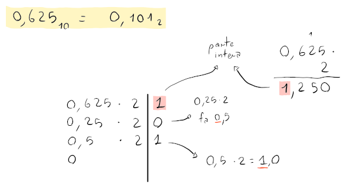

# Numeri con la virgola

In generale, i numeri con la virgola possono essere rappresentati in binario utilizzando la **virgola fissa**.

Le posizioni dei numeri dopo la virgola seguiranno l'andamento della parte intera, ma in negativo, quindi $0.101_2 = 1 \cdot 2^{-1} + 0 \cdot 2^{-2} + 1 \cdot 2^{-3} = 0.625_{10}$

Per convertire un numero con la virgola in base 2, sarà sufficente separare la conversione della parte decimale, visto che usa il processo inverso rispetto alla conversione della parte intera.

Se si vuole convertire un numero con la virgola in _complemento a due_, basterà trattarlo come se la virgola non esistesse.
Per esempio, su 8 bit totali, $-1.25_{10} = -0001.0100_2 = 1110.1100_2$.

## Virgola mobile

Questo è il metodo tutt'ora più utilizzato per la rappresentazione di numeri reali in binario.

Segue lo stesso concetto della notazione scientifica (e.g. $6.02 \cdot 10^{23}$), ma in binario separando il numeri in vari componenti:
- **Segno**
- **Esponente**, che specifica la posizione della virgola
- **Mantissa**, cioè la parte frazionaria

In questo tipo di rappresentazione, l'**overflow** capita solamente se l'esponente non ha abbastanza bit per essere rappresentato.
