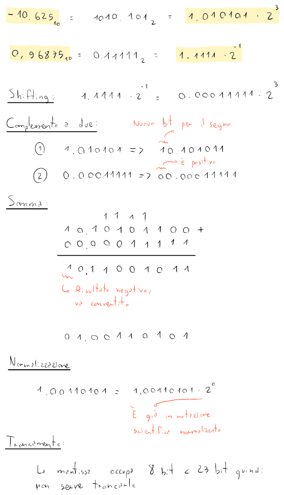

# IEEE754

Questo standard usa la **virgola mobile**, e quindi è composto da:
- **Segno** a 1 bit
- **Esponente** a 8 bit
- **Mantissa** a 23 bit

Per cui otteniamo che il numero rappresentato è:
$$(-1)^{S_{10}} \cdot (1 + M_2) \cdot 2^{E_{10}}$$

## Conversioni

1. Se il numero in _IEEE754_ è $0 \space 10000001 \space 01000000000000000000000_2$, allora:

	- $S = 0$, allora è positivo
	- $E = 10000001_2 - 127_{10} = 2_{10}$
	- $M = 1 + 0.01...0_2 = 1.01_2$

	Quindi il numero sarà $(-1)^0 \cdot 1.01 \cdot 2^2 = 101_2 = 5_{10}$.

2. Per convertire $-12.5_{10} = -1100.1_2 = -1.1001_2 \cdot 2^3$ in _IEEE754_ basterà fare il processo inverso:

	- $S = 1$, perchè è negativo
	- $E = 3 + 127 = 130 = 10000010_2$
	- $M = 1.1001_2 = 1 + 0.1001_2$

	Quindi il numero sarà $1 \space 10000010 \space 10010000000000000000000_2$.

## Somme

Per sommare due numeri in _IEEE754_, basterà fare la somma in colonna dopo aver **allineato gli esponenti** portando quello più piccolo a quello più grande, e dopo aver **convertito i numeri negativi in complemento a due**.

Nel caso in cui si sia limitati nella precisione di bit (che di norma è 23), basterà scartare i bit in eccesso.
Per esempio, con una precisione da 4 bit, $1.00110101 \cdot 2^0$ diventerà $1.0011 \cdot 2^0$.

Per provare le operazioni in _IEEE754_ si può usare [questo sito](http://weitz.de/ieee/) dopo aver selezionato _binary32_.

## Errori di precisione

Il troncamento avviene quando non ci sono bit sufficienti nella mantissa.
Questo significa che a volte le somme potrebbero perdere precisione se si lavora con **numeri troppo grandi e troppo piccoli**.
