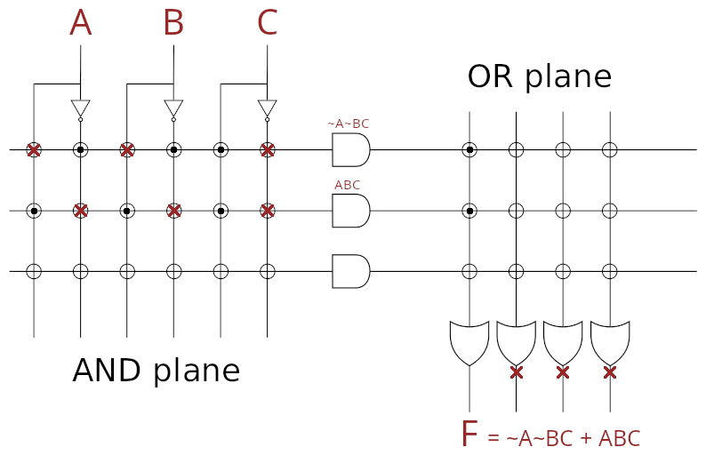

# Altri componenti

## Decoder

Il decoder prende come input $n$ bit e metterà a $1$ uno dei suoi $2^n$ output che corrisponde al valore binario assunto dall'input.

Per esempio, l'input $011$ attiverà il quarto cavo di output che ha indice $3$.

## PLA

Il **Programmable Logic Array** è una griglia di **AND** e **OR**, dove ogni cavo è collegato attraverso un **fusibile** che permette di programmare il comportamento dell'array.

La prima parte è formata dalla griglia _AND_ e la seconda dalla griglia _OR_, così che bruciando i fusibili si ottenga un'equazione in forma canonica di **Somme di prodotti**.

## ROM

Esistono due tipi di **Read Only Memory**:
- **PROM** (_Programmable ROM_): è programmabile una sola volta
- **EPROM** (_Erasable Programmable ROM_): si può cancellare con della luce ultravioletta

Tramite l'uso della _ROM_ è possibile simulare un circuito logico, perchè è possibile usare il valore binario degli input come **indirizzo** che punta alle celle della _ROM_, che conterrà i valori binari di output.

Per esempio, usando i tre input $101$ come indirizzo, si prenderà il bit di output dalla cella che ha indirizzo $5$.
