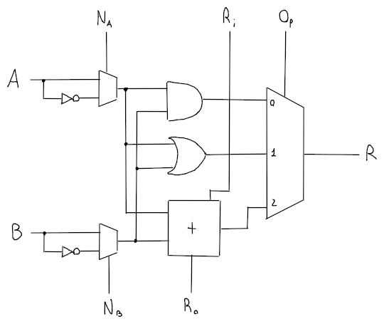
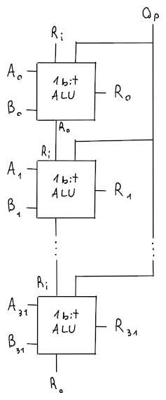

# ALU

L'**ALU**, che sta per _Arithmetic Logic Unit_, ha lo scopo di eseguire operazioni **aritmetiche e logiche** come `and`, `or`, `add`, `beq`, etc.

## Somma

La somma di due numeri a _32 bit_ sulla ALU è formata da **1 bit adder** (una serie da 32) con la tabella di verità:

| $A$ | $B$ | $R_i$ | $S$ | $R_o$ |
|:-:|:-:|:-:|:-:|:-:|
| 0 | 0 | 0 | 0 | 0 |
| 0 | 0 | 1 | 1 | 0 |
| 0 | 1 | 0 | 1 | 0 |
| 0 | 1 | 1 | 0 | 1 |
| 1 | 0 | 0 | 1 | 0 |
| 1 | 0 | 1 | 0 | 1 |
| 1 | 1 | 0 | 0 | 1 |
| 1 | 1 | 1 | 1 | 1 |

dove $R_i$ è il riporto precedente, $S$ è la somma e $R_o$ è il riporto dell'operazione.

Minimizzando la tabella si arriva ad avere che:
$$
S = \neg AB \neg R_i + A \neg B \neg R_i + \neg A \neg B R_i + ABR_i \\
R_o = AB + BR_i + AR_i
$$
ma dato che $S$ non è semplificabile, si possono usare le porte **XOR**, infatti:

| $A$ | $B$ | Somma | XOR |
|:-:|:-:|:-:|:-:|
| 0 | 0 | 0 | 0 |
| 0 | 1 | 1 | 1 |
| 1 | 0 | 1 | 1 |
| 1 | 1 | 0 | 0 |

e quindi:
$$
S = (A \oplus B) \oplus R_i \\
R_o = AB + (A \oplus B) R_i
$$

## Sottrazione

Utilizzando il **complemento a due** e l'adder è possibile ottenere una somma, dato che:
$$A - B = A + (-B) = A + (\neg B + 1)$$

Di conseguenza basterà fare la somma tra $A$ e $\neg B$, mettendo il riporto entrante $R_i = 1$, in modo da considerare anche il $+1$.

## Confronto

Un'altra funzione della _ALU_ è quella di confronto, che servirà poi per implementare l'istruzione `slt`:
$$Op = 3 \land A < B \Rightarrow R = 1$$

Lo stato del confronto si può ottenere dalla _ALU_ sul _MSB_ (_Most Significant Bit_) da cui viene letto il bit di segno della sottrazione tra $A$ e $B$, con gli appropriati resti:
$$A - B < 0 \Rightarrow A < B \Rightarrow S = 1$$
dove il valore di $S$ verrà usato come input per $L$ (cioè _less_) sulla prima _ALU_ in modo che $R = 1 \lor R = 0$, visto che il numero $1$ ha solo il _LSB_ (_Least Significant Bit_) attivo.

Questo però non funziona se $A > 0$ e $B < 0$, perchè $A + (-B)$ è una somma tra due numeri positivi che può portare ad **overflow**, cosa che potrebbe dare un $S$ errato per cui il risultato $R$ sarebbe sbagliato.

## ALU da 1 bit



dove:
- $A$, $B$ sono gli input della ALU
- $N_A$, $N_B$, sono dei flag con cui si decide se usare la versione negativa di $A$ o di $B$ come input
- $R_i$ è il riporto precedente, mentre $R_o$ è il riporto di output
- $Op$ indica quale operazione vogliamo dalla ALU
- $R$ è il risultato dell'operazione
- $L$, $S$ sono usati internamente per la condizione $A < B$
- $O$ indica l'overflow della somma

Quindi è possibile riassumere le operazioni in:

| $N_A$ | $N_B$ | $R_i$ | $Op$ | $R$ |
|:-:|:-:|:-:|:-:|:-:|
| 0 | 0 | 0 | 00 | $A$ _and_ $B$ |
| 0 | 0 | 0 | 01 | $A$ _or_ $B$ |
| 0 | 0 | 0 | 10 | $A + B$ |
| 0 | 1 | 1 | 10 | $A - B$ |
| 0 | 1 | 1 | 11 | $\begin{cases}1 & A < B \\ 0 & A \geq B\end{cases}$ |
| 1 | 1 | X | 00 | $A$ _nor_ $B$ |

e visto che non ci interessa lo stato $R_i$ per il **NOR**, è possibile porre $R_i = N_B$ sulla prima _1 bit ALU_ nella catena delle _ALU_.

## ALU da 32 bit

Per ricavare la ALU da 32 bit basta concatenare le varie _ALU da 1 bit_ per ogni bit della _word_.



dove $Z$ equivale al **NOR** tra tutti i bit di output e sarà $1$ quando $R = 0$.

Questa _ALU_ però, avrà performance abbastanza lente, perchè ogni riporto di ogni _1 bit adder_ dovrà propagarsi per tutta la catena di _1 bit ALU_, cosa che rallenterà il segnale.
Per migliorare le prestazioni quindi, esiste un metodo chiamato **Carry Lookahead**.

## Moltiplicazione

Questa parte non sarà contenuta all'interno dell'_ALU_ ma la sfrutterà per creare l'algoritmo che permette la moltiplicazione tra due numeri.

L'algoritmo si basa sul metodo di **moltiplicazione in colonna** e si può riassumere in:
```c
int mul(int a, int b) {
	int sum = 0;
	while (b > 0) {
		if (b & 0x1) {
			sum += a;
		}
		a <<= 1;
		b >>= 1;
	}
	return sum;	// a * b
}
```
