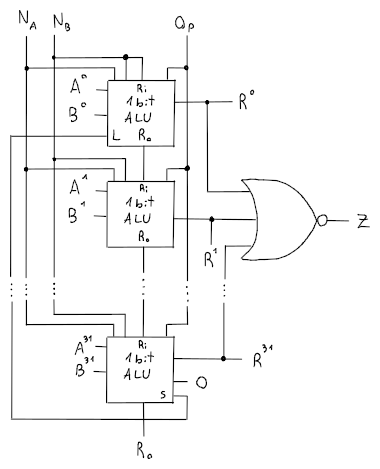

# ALU

L'**ALU**, che sta per _Arithmetic Logic Unit_, ha lo scopo di eseguire operazioni **aritmetiche e logiche** come `and`, `or`, `add`, `beq`, etc.

## Somma

La somma di due numeri a _32 bit_ sulla ALU è formata da **1 bit adder** (una serie da 32) con la tabella di verità:

| $A$ | $B$ | $R_i$ | $S$ | $R_o$ |
|:-:|:-:|:-:|:-:|:-:|
| 0 | 0 | 0 | 0 | 0 |
| 0 | 0 | 1 | 1 | 0 |
| 0 | 1 | 0 | 1 | 0 |
| 0 | 1 | 1 | 0 | 1 |
| 1 | 0 | 0 | 1 | 0 |
| 1 | 0 | 1 | 0 | 1 |
| 1 | 1 | 0 | 0 | 1 |
| 1 | 1 | 1 | 1 | 1 |

dove $R_i$ è il riporto precedente, $S$ è la somma e $R_o$ è il riporto dell'operazione.

Minimizzando la tabella si arriva ad avere che:
$$
S = \neg AB \neg R_i + A \neg B \neg R_i + \neg A \neg B R_i + ABR_i \\
R_o = AB + BR_i + AR_i
$$
ma dato che $S$ non è semplificabile, si possono usare le porte **XOR**, infatti:

| $A$ | $B$ | Somma | XOR |
|:-:|:-:|:-:|:-:|
| 0 | 0 | 0 | 0 |
| 0 | 1 | 1 | 1 |
| 1 | 0 | 1 | 1 |
| 1 | 1 | 0 | 0 |

e quindi:
$$
S = (A \oplus B) \oplus R_i \\
R = AB + (A \oplus B) R_i
$$

## Sottrazione

Utilizzando il **complemento a due** e l'adder è possibile ottenere una somma, dato che:
$$A - B = A + (-B) = A + (\neg B + 1)$$

Di conseguenza basterà fare la somma tra $A$ e $\neg B$, mettendo il riporto entrante $R_i = 1$, in modo da considerare anche il $+1$.

## ALU da 1 bit

Dove:
- $A$, $B$ sono gli input della ALU
- $N_A$, $N_B$, sono dei flag che dicono se usare oppure no la versione negativa di $A$ o quella di $B$
- $R_i$ è il riporto precedente, mentre $R_o$ è il riporto di output
- $Op$ indica quale operazione vogliamo dalla ALU
- $R$ è il risultato dell'operazione

Quindi è possibile riassumere le operazioni in:

| $N_A$ | $N_B$ | $R_i$ | $Op$ | $R$ |
|:-:|:-:|:-:|:-:|:-:|
| 0 | 0 | 0 | 0 | $A$ _and_ $B$ |
| 0 | 0 | 0 | 1 | $A$ _or_ $B$ |
| 0 | 0 | 0 | 2 | $A + B$ |
| 0 | 1 | 1 | 2 | $A - B$ |
| 1 | 1 | 0 | 0 | $A$ _nor_ $B$ |

## ALU da 32 bit

Per ricavare la ALU da 32 bit basta concatenare le varie _ALU da 1 bit_ per ogni bit della _word_.

