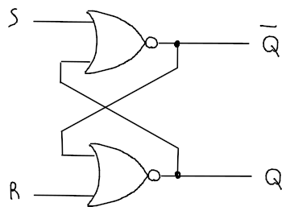
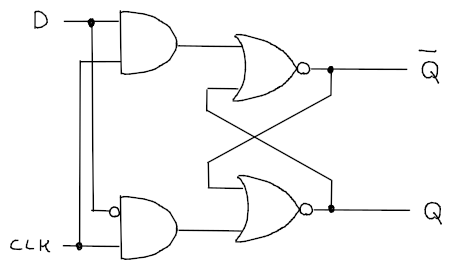
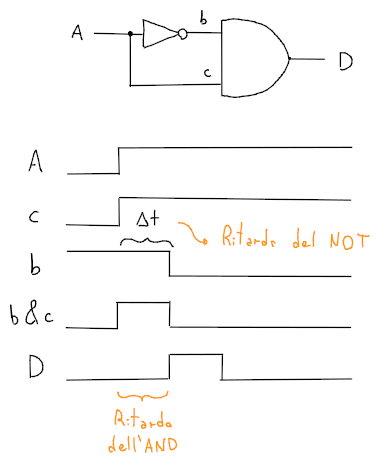
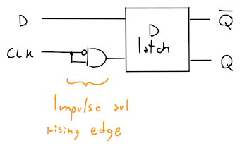
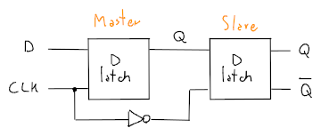
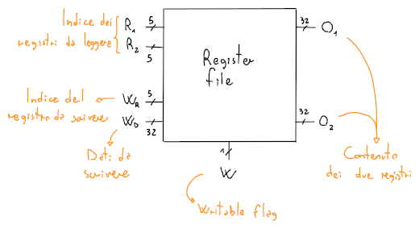
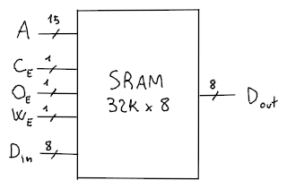
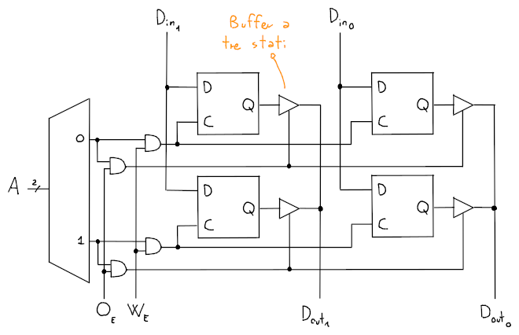

# Circuiti sequenziali

I **circuiti sequenziali** sono circuiti composti da _circuiti combinatori_ (cioè che dipendono solo da input e output) e da un **registro**.
Di conseguenza, oltre che agli input dipendono anche dallo stato del circuito.

## S-R Latch

Con questo _latch_ è possibile memorizzare un singolo bit di memoria in modo _asincrono_.

Quindi, la tabella di verità per il componente sarà:

| $S$ | $R$ | $Q$ | $\overline Q$ |
|:-:|:-:|:-:|:-:|
| 0 | 0 | / | / |
| 0 | 1 | 0 | 1 |
| 1 | 0 | 1 | 0 |
| 1 | 1 | ? | ? |

per cui, quando $S = R = 0$ gli input non avranno effetto sullo stato del circuito, mentre se $S = R = 1$, il circuito avrà comportamento indefinito.

## Clock

Il **clock** (CLK) è un componente che rende il circuito **sincrono** rispetto al suo periodo, cioè il tempo minimo richiesto dal circuito perchè diventi stabile.

## D latch

Un esempio di circuito sincrono è il **D latch**, che corrisponde al _S-R latch_ ma con il clock.

Che avrà tabella di verità:

| $CLK$ | $D$ | $Q$ | $\overline Q$ |
|:-:|:-:|:-:|:-:|
| 0 | 0 | / | / |
| 0 | 1 | / | / |
| 1 | 0 | 0 | 1 |
| 1 | 1 | 1 | 0 |

Questo componente però, è detto **trasparente** perchè i cambiamenti sono instantanei quando il clock è alto, infatti se $D$ cambia mentre $CLK = 1$ anche il _latch_ cambierà stato.
Per risolvere questo problema esistono i **flip-flop**.

## Tempistiche

La memorizzazione può avvenire in due modi:
- **Level triggered**, per cui fa effetto nella durata in cui $CLK = 1$
- **Edge triggered**, per cui il circuito viene azionato sul **rising-** o **falling-edge** del clock

## Generatore di impulsi

Il generatore di impulsi sfrutta il ritardo causato dai componenti per generare un singolo impulso di clock ai componenti per aggiornarli sul _rising-edge_.

## Flip-flop

Esistono due tipi di flip-flop:
- **Semplice**, che viene aggiornato sul rising-edge con il _generatore di impulsi_

	

- **D flip-flop**, che viene aggiornato sul falling-edge sfruttando due _D latch_

	

## Register file

Un **register file** è un componente che contiene più singoli registri (ognuno composto da 32 flip-flop con lo stesso clock) e permette la lettura di due registri e la scrittura di uno.

L'input $W$ serve ad abilitare la scrittura sul registro $W_R$, e blocca semplicemente il clock con un _AND_.

## SRAM

La **Static RAM** fornisce una memoria molto veloce attraverso l'uso dei _latch_, che non permettono di leggere e scrivere contemporaneamente, visto che sono trasparenti.
Un esempio è la memoria cache.

Il blocco di memoria è realizzato con una matrice di _latch_ largo $W$ e alto $H$, per cui l'accesso ad ogni cella richiede un indirizzo che ha $\log_2H$ bit.

dove:
- $A$ è l'indirizzo che si vuole leggere/scrivere
- $D_{in}$ è il contenuto che si vuole scrivere
- $D_{out}$ è l'output della cella che si vuole leggere
- $C_E$, $O_E$, $W_E$ servono rispettivamente ad abilitare l'intero _chip_, l'_output_ e la _scrittura_

Per esempio, la struttura di una _SRAM_ da $2 \times 2$ ($2$ righe da $2$ bit) sarà:

dove il **buffer a tre stati** serve per disabilitare gli output agli indirizzi non richiesti e quindi rimuove la necessità di un grande _multiplexer_.

Per ottimizzarlo ancora e liberarsi del _demultiplexer_ in entrata, si possono utilizzare più _SRAM_ concatenate che dividono la grandezza dell'indirizzo $A$ in due parti:
- **Parte alta**, che identifica la riga di ogni _SRAM_
- **Parte bassa**, che identifica con dei multiplexer quale bit in output delle _SRAM_ è quello di interesse, e quindi la colonna di ogni output

Per cui ogni riga, identificata dalla parte alta, di ogni _SRAM_ contiene tutti i bit indirizzabili dalla parte bassa.

## DRAM

La **Dynamic RAM** è meno costosa e più capiente rispetto alla _SRAM_, ma è anche più lenta.

Sono realizzate tramite una coppia di **transistor** e **condensatore** per ogni bit, dove il valore del condensatore viene messo sulla _bit line_ quando la _word line_, che identifica l'indirizzo, è alta.

I condensatori tengono i valori solo per pochi millisecondi, e quindi necessitano di un _refresh dinamico_.

## SSRAM e SDRAM

Esistono delle alternative alle _SRAM_ e le _DRAM_, che includono il **clock** e sono quindi **sincrone**.
