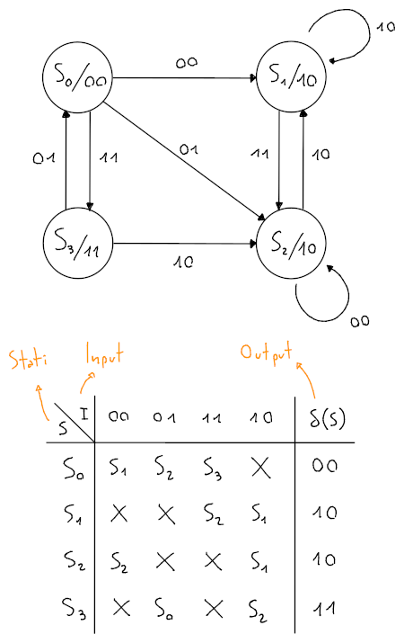
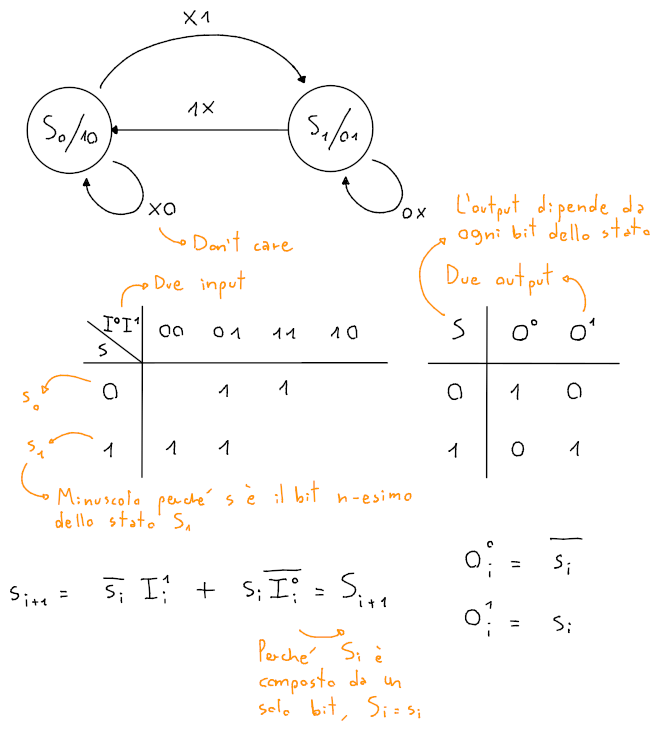
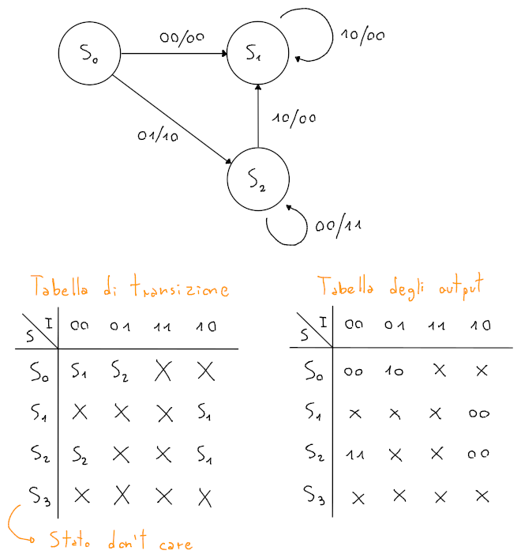

# Automi per circuiti

## Automi di Moore

In un circuito sequenziale di **Moore** si ha che:
- $O_i = \delta(S_i)$, quindi ogni **output** dipende dallo stato corrispondente
- $S_{i+1} = \lambda(I_i, S_i)$, per cui la **transizione di stato** dipende dall'input e dallo stato precedente

Ogni possibile transizione viene rappresentata dalla **tabella di transizione di stato**, per esempio:

La **minimizzazione** della tabella di transizione consiste nel trovare un'equazione minimizzata per ogni n-esimo bit che compone lo stato, in modo da trovare la funzione $\lambda$, per esempio:

## Automi di Mealy

Al confronto del circuito di _Moore_, in quello di **Mealy** si ha che:
- $O_i = \delta(I_i, S_i)$
- $S_{i+1} = \lambda(I_i, S_i)$

Quindi, l'output non verrà posizionato sui nodi affianco agli stati, ma sugli archi affianco agli input, per esempio:

Vanno quindi fatte le due _mappe di Karnaugh_ per i bit di $S_i$ e per quelli di $O_i$, per poi ricavarne le equazioni.
