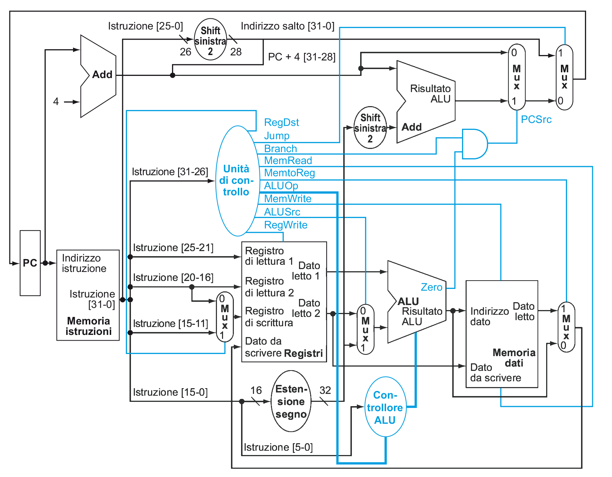

# CPU

La più semplice CPU realizzabile è quella a **ciclo singolo**, cioè che ogni istruzione richiede un **singolo ciclo di clock** per effettuare il _Fetch-Decode-Execute_.

L'accesso ai **registri** e alla **memoria** verrà effettuato da:
- `M[x]`, cioè la _word_ all'indirizzo `x`
- `R[y]`, cioè il registro `y`

## Istruzioni

Le istruzioni principali sono:
- _Memory-reference_: `lw`, `sw`
- _Arithmetic-logic_: `add`, `sub`, `and`, `or`, `slt`
- _Control-flow_: `beq`, `j`

Decodificando i vari [tipi di istruzioni](../03/README.md#formati-delle-istruzioni), otteniamo:
- `rd`, `rt`, `rs`, cioè i registri
- `Imm16`, `Imm26`, che corrispondono ai valori _immediati_ delle istruzioni

### Implementazione

Di conseguenza il pseudocodice delle operazioni che riuscirà a fare il processore è:
- `add`: `R[rd] = R[rs] + R[rt]; PC += 4;`
- `sub`: `R[rd] = R[rs] - R[rt]; PC += 4;`
- `lw`: `R[rt] = M[R[rs] + sign_ext(Imm16)]; PC += 4;`
- `sw`: `M[R[rs] + sign_ext(Imm16)] = R[rt]; PC += 4;`
- `beq`: `PC += 4; if (R[rs] == R[rt]) {PC += sign_ext(Imm16) << 2;}` dove `sign_ext(Imm16)` corrisponde all'_estensione in CA2_ di `Imm16` (e.g. $-2_{10} = 1110_2 = 1111 1110_2$)
- `j`: `PC = (PC + 4)[31-28] | (Imm26 << 2);` dove:
	- `Imm26 << 2` corrisponde a `Imm26 * 4`, e serve per allineare l'indirizzo alla _word_
	- mentre l'_OR_ con `(PC + 4)[31-28]` (dal bit 28 perchè lo shift occupa 2 bit in più) serve per completare l'indirizzo, visto che nei 26 bit della _J-Type_ non ci sta un indirizzo di memoria assoluto

## Circuito a Singolo Ciclo

### Struttura

Separando dal circuito le due memorie si può riordinare per ottenere due scatole nere:

- **Datapath** (circuito **sequenziale** in _nero_): è la parte della _CPU_ che ha il compito di effettuare i vari calcoli (assieme alla _ALU_) il cui risultato dipende dallo stato dei registri

- **Control** (circuito **combinatorio** in _blu_): ha il compito di decidere quali componenti del _datapath_ attivare e quali no in base all'istruzione letta (e nel caso di _Zero_ dal risultato ottenuto dalla _ALU_)

### Controllo ALU

L'[input di controllo](../04/README.md#alu-da-32-bit) della _ALU_,
$$\text{Operation} = (N_A, N_B, Op_1, Op_0)$$
si ricava in base all'**opcode** (da cui $\text{ALUOp}$) e a **funct** (per le _R-Type_, il resto è _don't care_) dell'istruzione letta:

| $\text{ALUOp}$ | $\text{Funct}$ | $\text{Operation}$ | Istruzione |
|:-:|:-:|:-:|:-:|
| 00 | XXXXXX | 0010 | `lw`/`sw` |
| 01 | XXXXXX | 0110 | `beq` |
| 10 | XX0000 | 0010 | `add` |
| 10 | XX0010 | 0110 | `sub` |
| 10 | XX0100 | 0000 | `and` |
| 10 | XX0101 | 0001 | `or` |
| 10 | XX1010 | 0111 | `slt` |

da cui:
$$
\begin{split}
&N_A = 0 \\
&N_B = (\text{Funct}_1 \cdot \text{ALUOp}_1) + \text{ALUOp}_0 \\
&Op_1 = \neg \text{Funct}_2 + \neg \text{ALUOp}_1 \\
&Op_0 = (\text{Funct}_0 + \text{Funct}_3) \cdot \text{ALUOp}_1
\end{split}
$$

### Svantaggi

Tra gli svantaggi di questo tipo di _CPU_ ci sono:

- **Memorie duplicate**:

	Dato che in un _singolo ciclo_ non è possibile effettuare sia lettura che scrittura, vengono usate **due memorie**: una per le **istruzioni** e una per i **dati**, in modo da poter leggere l'istruzione in posizione `PC` ed eseguire anche `lw` o `sw`.

- **Adder in eccesso**:

	Le operazioni che richiedono la _ALU_ (e.g. _somma_, _sottrazione_, ...) la tengono **occupata** per l'intero ciclo di clock. Per questo motivo non è possibile utilizzarla per `PC += 4`, nemmeno con `beq` visto che è impegnata nella sottrazione dei due operandi per trovare _Zero_.

- **Periodo di clock prolungato**:

	Se il _periodo del clock_ fosse variabile in base all'istruzione, si avrebbe un tempo medio $T_{\text{medio}} = 630\mathrm{ps}$ (_picosecondi_), con un massimo di $T_{\text{fisso}} = 800\mathrm{ps}$ (per `lw`) e un minimo di $200\mathrm{ps}$ (per `j`), che produrrebbe uno **speedup** pari a:
	$$\frac{T_{\text{fisso}}}{T_{\text{medio}}} = \frac{|I| \cdot 800\mathrm{ps}}{|I| \cdot 630\mathrm{ps}} = 1.27 \text{ volte}$$
	dove $|I|$ è il numero di istruzioni di un programma.

	Dato però che il _periodo_ **non è variabile**, bisogna assicurare la stabilità del circuito per tutte le istruzioni e quindi renderlo pari al tempo massimo $T_{\text{CLK}} = T_{\text{fisso}} = 800\mathrm{ps}$.

	Questo problema è risolto con la _CPU_ a **multiciclo**, che suddivide ogni istruzione in più step (ognuno dei quali richiede lo stesso $T_{\text{CLK}}$ _ridotto_), diminuendo il tempo totale in base all'istruzione eseguita.
