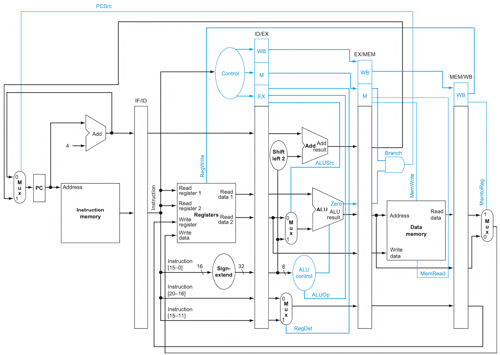

# Implementazione

Per suddividere il signolo ciclo in _unità funzionali_, occorre ricordare il risultato dell'_unità_ (e quindi del ciclo) precedente.
Questo è possibile con dei **registri intermedi** tra le sezioni (e.g. _IF/ID_, _ID/EX_, ...), che salveranno 4 byte per ogni freccia entrante (i.e. 20 byte su _ID/EX_) per propagare il risultato nelle sezioni e cicli successivi.

Questo però porta a problemi non banali durante l'esecuzione:

- **Propagazione dei segnali di controllo**:

	Perchè ogni _unità_ esegui parallelamente, è necessario **rallentare** la propagazione dei _segnali di controllo_ in modo che siano coerenti con l'istruzione eseguita.

	Per questo nel circuito sono implementati **altri registri intermedi** riservati per la parte di controllo.

- **WB nel register file**:

	Perchè il _Write Back_ riesca a scrivere sul _register file_ c'è bisogno del valore che identifica il registro su cui scrivere, ma quando la _pipeline_ sarà arrivata a _WB_, anche _ID_ sarà stato rieseguito da un'altra istruzione, sovrascrivendo quindi il valore richiesto.

	Di conseguenza, nel circuito viene anche propagato il valore del _Write register_ fino a _WB_.

- **Hazards**
