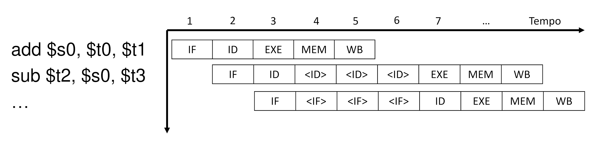

# Hazards

Un'**hazard** è una situazione in cui un'istruzione dipende da quella prima, per esempio:
```x86asm
add $s0, $t0, $t1
sub $s1, $s0, $s2  ; Necessita del WB precedente per poter leggere su ID il register file
```

Per rimediare, la _pipeline_ entrerà in **stallo**, continuando a **rieseguire** _ID_ (bloccando un'ipotetica terza istruzione su _IF_ perchè _ID_ è in uso) finché l'istruzione precedente non finisce.



L'ultimo _ID_ avrà lo scopo di aggiornare i registri _ID/EX_ con il valore scritto dalla precedente _WB_.
Questo può avvenire nello **stesso ciclo** di _WB_ nel caso il _register file_ supporti lettura e scrittura in un unico ciclo.

Questo _hazard_ è un **data hazard** detto **dipendenza RAW** (_Read After Write_), ma esistono altre dipendenze come _Write After Write_ e _Write After Read_ (creano problemi solo quando si cambia l'ordine delle istruzioni).

## Soluzione software

Un'alternativa _software_ è sfruttare il **compilatore** per inserire dei `nop` **tra le istruzioni dipendenti**:

```x86asm
add $s0, $t0, $t1  ; IF
nop                ; ID
nop                ; EXE
nop                ; MEM
sub $s1, $s0, $s2  ; WB durante l'IF di sub, quindi esegue ID dopo WB
```

Oltre ad **alleggerire** lo sforzo della CPU nell'identificazione dello _stallo_ (che effettua confrontando registri correnti e precedenti nel passo _ID_), ammette anche ulteriore **ottimizzazione**, rimpiazzando i `nop` con alcune istruzioni successive, così da risparmiare tempo.
