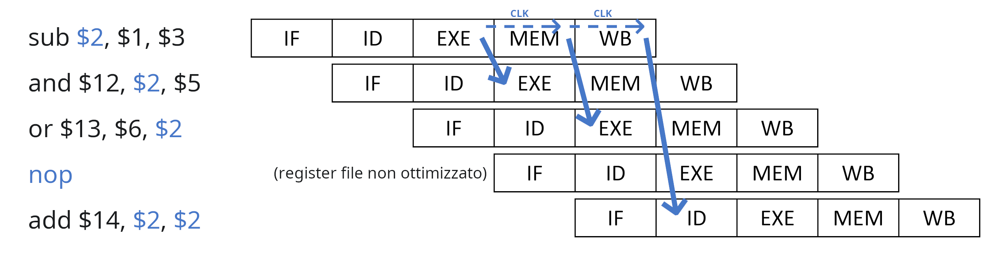
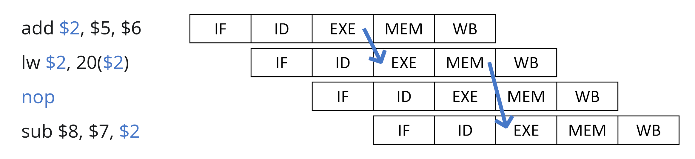

# Forwarding

Una soluzione alla lentezza causata dall'identificazione degli _hazards_ è il **forwarding**, che permette di intercettare le informazioni che ci servono dalle _unità_ intermedie senza aspettare il _WB_ (_Write Back_).

Nel caso delle **operazioni aritmetiche** è quindi possibile intercettare il risultato dall'_ALU_ nell'_unità_ **EXE**:



Nel caso della **load** invece, bisogna aspettare che la memoria finisca la lettura nell'_unità_ **MEM**:



## Branching

Un altro problema è che le istruzioni a seguito di una `beq` fanno in tempo a entrare nella _pipeline_:
```x86asm
beq $1, $2, 10
add $5, $3, $4  ; Esegue IF, ID, EXE
sub $6, $2, $5  ; Esegue IF, ID
and $3, $6, $1  ; Esegue IF
sw $3, 20($7)   ; Non viene eseguita perchè il PC viene aggiornato
```

Per risolvere questo problema esistono i seguenti approcci:
1. **Si inseriscono tre `nop`** al posto delle istruzioni successive
2. **Si bloccano se il branch è _taken_**, dato che sono al più arrivate a _EXE_ e devono ancora fare alterazioni
3. **Si prevede il branch**, salvando su una tabella l'**indirizzo dell'istruzione**, l'**indirizzo di salto** e due **bit di stato** con cui viene scelto se predire il salto oppure no
4. **Delayed branch**, per cui si **sposta la logica** su _ID_ (il _register file_ occupa meno del periodo di clock), calcolando [`Zero`](../../../ct0615-1/07/README.md#circuito-a-singolo-ciclo) con uno `XOR` e eseguendo `PC += sign_ext(Imm16) << 2` già dentro _ID_

L'ultima opzione è quella adottata dal _MIPS_, dato che solo l'istruzione successiva viene eseguita oltre al `beq`:
```x86asm
add $2, $1, $3
nop             ; Permette alla beq di ricevere $2 dall'EXE di add su ID
beq $1, $2, 15  ; Ha già l'esito del branch su ID
and $3, $4, $5  ; Viene eseguita perchè fa a tempo ad entrare il suo IF
lw $1, 10($6)   ; Non viene eseguita se beq è taken
nop
nop             ; Permettono alla beq di ricevere $1 dal MEM di lw su ID
beq $1, $2, 5
sw $1, 10($7)   ; Non viene eseguita se beq è taken
```

Di conseguenza, le dipendenze si possono riassumere in:

| Operazione | Dipendenze entranti | Dipendenze uscenti |
|:-:|:-|:-|
| _ALU_ | _EXE_ (operandi) | _EXE_ (risultato) |
| `lw` | _EXE_ (somma dei registri per l'indirizzo) | _MEM_ (valore letto) |
| `sw` | _EXE_ (id. `lw`) o _MEM_ (valore da scrivere) | - |
| `beq` | _ID_ (registri per il confronto) | - |

## Esempio

Per esempio, il seguente codice:
```x86asm
loop:
lw $t0, 0($s0)
nop                 ; Sposta l'EXE di addi dopo il MEM di lw
addi $t0, $t0, 20   ; Dal MEM di lw all'EXE di addi
sw $t0, 0($s1)      ; Dal MEM di addi (portato avanti dall'EXE) al MEM di sw
addi $s0, $s0, 4
addi $s1, $s1, 4    ; Sposta l'ID di bne dopo l'EXE di addi per $s0
bne $s0, $a0, loop  ; Dall'EXE di addi all'ID di bne
nop                 ; Delay slot del branch
```
viene eseguito in 12 cicli di clock, mentre se si ottimizza:
```x86asm
loop:
lw $t0, 0($s0)
addi $s0, $s0, 4
addi $t0, $t0, 20
sw $t0, 0($s1)
bne $s0, $a0, loop
addi $s1, $s1, 4
```
si arrivano ad usare solamente 10 cicli di clock.
