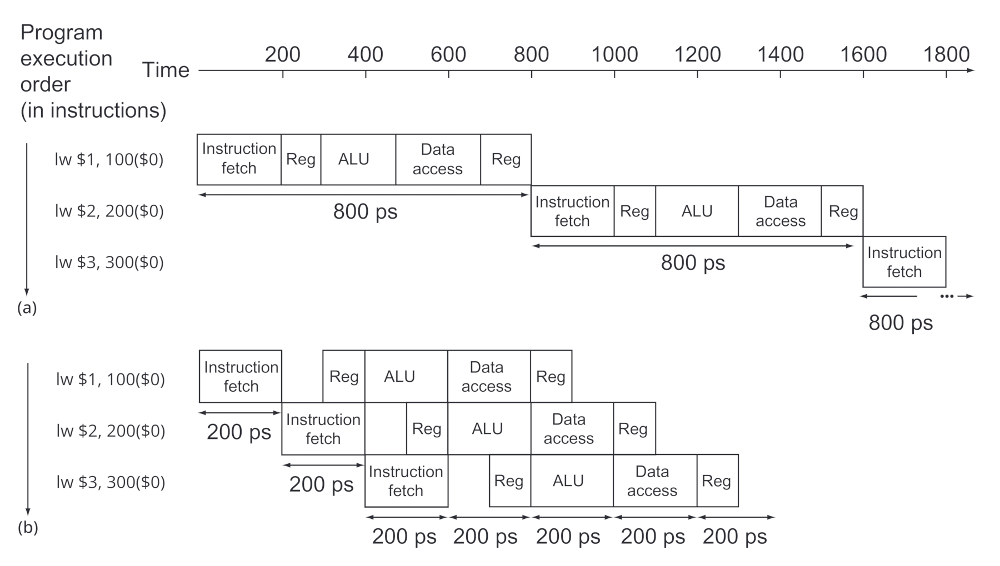
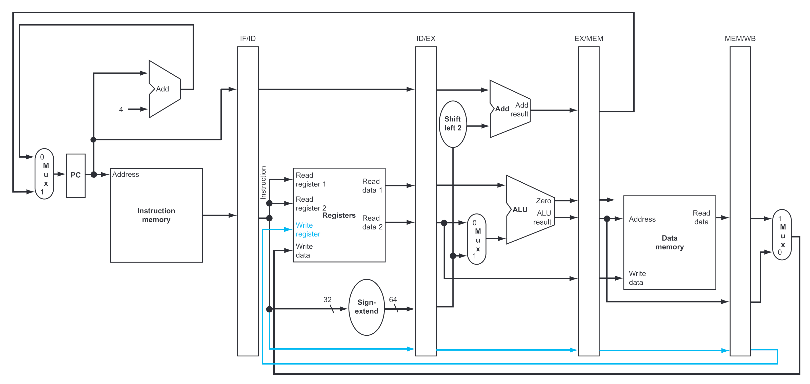

# Pipeline

Ogni ciclo della CPU [a singolo ciclo](../../ct0615-1/07/README.md#circuito-a-singolo-ciclo) può essere suddiviso in _unità funzionali_, cioè delle operazioni fondamentali che possono essere parallelizzate per ottenere la **CPU pipeline**:
- **IF** (_Instruction Fetch_): **lettura** dell'istruzione e **incremento** PC
- **ID** (_Instruction Decode_): **scomposizione** istruzione (i 32 bit) e **lettura** registri
- **EX** (_Execute_): **esecuzione** ALU (per `add`/`lw`/`sw`) e **calcolo** indirizzo per `beq`
- **MEM** (_Memory Access_): **lettura**/**scrittura** in memoria (per `lw`/`sw`)
- **WB** (_Write Back_): **scrittura** sul registro (per `add`/`lw`)

L'implementazione avviene eseguendo ogni _unità funzionale_ **parallelamente** alle istruzioni successive.



## Implementazione

Per suddividere il signolo ciclo in _unità funzionali_, occorre ricordare il risultato dell'_unità_ (e quindi del ciclo) precedente.
Questo è possibile con dei **registri intermedi** tra le sezioni (e.g. _IF/ID_, _ID/EX_, ...), che salveranno 4 byte per ogni freccia entrante (i.e. 20 byte su _ID/EX_) per propagare il risultato nelle sezioni e cicli successivi.



Questo però porta a problemi non banali durante l'esecuzione:

- **Propagazione dei segnali di controllo**:

	Perchè ogni _unità_ esegui parallelamente, è necessario **rallentare** la propagazione dei _segnali di controllo_ in modo che siano coerenti con l'istruzione eseguita.

	Per questo nel circuito sono implementati **altri registri intermedi** riservati per la parte di controllo.

- **WB nel register file**:

	Perchè il _Write Back_ riesca a scrivere sul _register file_ c'è bisogno del valore che identifica il registro su cui scrivere, ma quando la _pipeline_ sarà arrivata a _WB_, anche _ID_ sarà stato rieseguito da un'altra istruzione, sovrascrivendo quindi il valore richiesto.

	Di conseguenza, nel circuito viene anche propagato il valore del _Write register_ fino a _WB_.

- **Hazards**

## Hazards

Un'**hazard** è una situazione in cui un'istruzione dipende da quella prima, per esempio:
```x86asm
add $s0, $t0, $t1
sub $s1, $s0, $s2  ; Necessita del WB precedente per poter leggere su ID il register file
```

Per rimediare, la _pipeline_ entrerà in **stallo**, continuando a **rieseguire** _ID_ (bloccando un'ipotetica terza istruzione su _IF_ perchè _ID_ è in uso) finché l'istruzione precedente non finisce.


L'ultimo _ID_ avrà lo scopo di aggiornare i registri _ID/EX_ con il valore scritto dalla precedente _WB_.
Questo può avvenire nello **stesso ciclo** di _WB_ nel caso il _register file_ supporti lettura e scrittura in un unico ciclo.

Questo _hazard_ è un **data hazard** detto **dipendenza RAW** (_Read After Write_), ma esistono altre dipendenze come _Write After Write_ e _Write After Read_ (creano problemi solo quando si cambia l'ordine delle istruzioni).

Una soluzione _software_ è sfruttare il **compilatore** per inserire dei `nop` **tra le istruzioni dipendenti**:

```x86asm
add $s0, $t0, $t1  ; IF
nop                ; ID
nop                ; EXE
nop                ; MEM
sub $s1, $s0, $s2  ; WB durante l'IF di sub, quindi esegue ID dopo WB
```

Oltre ad **alleggerire** lo sforzo della CPU nell'identificazione dello _stallo_ (che effettua confrontando registri correnti e precedenti nel passo _ID_), ammette anche ulteriore **ottimizzazione**, rimpiazzando i `nop` con alcune istruzioni successive, così da risparmiare tempo.
