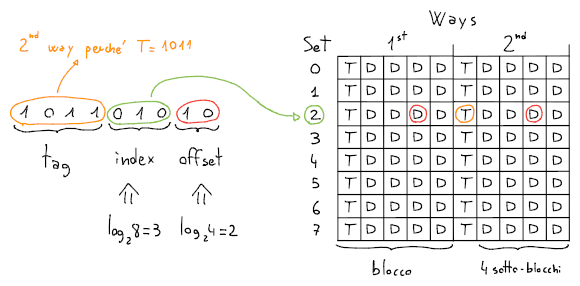

# Cache

Oltre alla [SRAM](../../ct0615-1/05/README.md#sram) (usata per la **cache**), e [DRAM](../../ct0615-1/05/README.md#dram) (usata per la **RAM**), che include il tipo _DDR SDRAM_ per trasferire sia sul _rising-_ che _falling-edge_, esiste anche la **flash NAND** (usata per le **SSD**), o _EEPROM_ (_Electrically Erasable Programmable ROM_), che con il **wear leveling** ne distribuiscono la scrittura per evitare il rapido consumo.

Più la memoria è veloce più costa, di conseguenza va sfruttato un principio di **gerarchia**, mettendo quelle più veloci con quantità minore più **vicino alla CPU**.

Per fare ciò si sfruttano i **principi di località**:
- **Località temporale**, per cui si tende ad accedere allo stesso dato più volte in brevi periodi di tempo
- **Località spaziale**, per cui si tende ad accedere ad altri dati che sono vicini a quello corrente

Attraverso la **gerarchia** si hanno degli **hit**, per cui il dato è stato **trovato**, e dei **miss**, per cui **va cercato** nella cache successiva, sulla memoria più vicina (e.g. _L1_).

Quindi, l'**hit time** è il tempo di accesso alla cache più vicina, mentre **miss penalty** è il tempo richiesto per caricare un dato da una memoria più distante alla cache e per passarlo alla CPU.

## Mapping

Una cache è suddivisa in **sets** (i.e. righe), ed ogni _set_ è composto da molteplici **ways** o **blocchi**.
Ogni _blocco_ contiene più byte provenienti dalle vicinanze dell'indirizzo di memoria su _RAM_ associato.

L'accesso alla cache avviene tramite:
- **Tag**, che contiene i rimanenti bit dell'indirizzo per evitare [collisioni](https://it.wikipedia.org/wiki/Principio_dei_cassetti)
- **Index**, che identifica il _set_ in cui si trova il blocco
- **Offset**, che identifica quale sotto-blocco (i.e. byte) è richiesto del blocco

Per esempio, su una cache con $8$ _set_, $2$ _blocchi_ da $4$ byte ciascuno:

La **dimensione ottimale** si può ottenere aumentando i byte dei blocchi per sfruttare al meglio la cache.
Va però bilanciata, perchè su blocchi più grandi **aumenta il tempo** richiesto dalla CPU per caricare i dati.

Inoltre, dimensioni molto elevate aumentano la probabilità di **collisioni**, considerati i molteplici sotto-blocchi inutilizzati (fuori contesto, e.g. bytes dopo la fine di un array) che vengono caricati nella cache.

Secondo questa struttura, una cache può essere:
- **Associativa**: con più _way_, richiede di attraversare tutti i blocchi per trovare il _tag_ richiesto.
	In caso di _miss_, il blocco che verrà rimpiazzato sarà o **casuale** o quello **meno recentemente utilizzato**.
- **Diretta**: con uno solo _way_, è più efficiente ma aumenta la probabilità di collisioni

## Conflitti

Quando un dato viene modificato con `sw`, la CPU aggiornerà per primo il blocco sulla cache.
Se però un indirizzo differente dovesse generare una collisione, il dato modificato potrebbe venire **sovrascritto** da una `lw` senza che venga prima aggiornato sulla _RAM_.

Nel caso della memoria dedicata alle istruzioni però, essendo _read-only_, questo problema non si presenta.

Tra le soluzioni a questo problema esistono due **politiche di coerenza**:
- **Write through**: forza la scrittura su _RAM_ ad ogni `sw` (anche se _write-hit_, rallentando di molto la CPU)
- **Write back**: scrive su _RAM_ quando `lw` fa collisione (rallentando `lw` nel caso di _read-miss_)

## Bit di stato

Oltre ai _tag_ e ai _dati_, ogni blocco contiene anche dei **bit di stato**:
- **Valid** bit, che specifica se il blocco è **vuoto** (e.g. dopo l'accensione)
- **Dirty** bit (per _write back_), indica se il blocco è stato **modificato** e va copiato al momento del rimpiazzo
- **Reference** bit, in caso di conflitti indica se il blocco è preferibile (i.e. se a $0$) per la **sovrascrittura** (per la politica _Least Recently Used_, i.e. impostato a $0$ periodicamente e a $1$ all'accesso)

## Tipi di miss

Oltre ai normali _miss_, esistono anche altri tre tipi di _miss_:
- **Compulsory**, cioè i _miss certi_: se la cache è vuota (i.e. _valid bit_ a $0$)
- **Capacity**: se un blocco continua ad essere _sovrascritto_ e a fare _miss_, quando la cache è troppo piccola
- **Collisions**, cioè i [conflitti](#conflitti): non capita se è _completamente associativa_, ovvero composta da un solo _set_

## Performance

Siano:
- $I$: il **numero di istruzioni**
- $I_D$: il numero di istruzioni che lavorano sui **dati** con `lw`/`sw`
- $T$: il **periodo di clock**, ovvero il tempo richiesto da ogni ciclo
- $m_p$: il **miss penalty**, cioè la quantità di cicli che vengono sprecati nel caso di _miss_
- $m_r$: il **miss ratio**, cioè la percentuale di istruzioni che causano _miss_
- $m_{r_I}$: l'**instruction miss ratio**, cioè la percentuale di _miss_ causati dal **fetch** delle istruzioni
- $m_{r_D}$: il **data miss ratio**, che riguarda i normali _miss_ dei dati
- $c_{\texttt{HLT}}$: il numero di **cicli di stallo**
- $c_{\texttt{EXE}}$: il numero di **cicli di esecuzione**
- $t_{\texttt{CPU}}$: il **tempo di esecuzione** delle istruzioni $I$

Allora:
$$
\begin{split}
m_r &= m_{r_I} + m_{r_D} \\
c_{\texttt{HLT}} &= (I \cdot m_{r_I} + I_D \cdot m_{r_D}) \cdot m_p \\
t_{\texttt{CPU}} &= (c_{\texttt{EXE}} + c_{\texttt{HLT}}) \cdot T
\end{split}
$$

Per esempio:
$$
m_{r_I} = 2\% = 0.02,\hspace{1em}
m_{r_D} = 4\% = 0.04,\hspace{1em}
m_p = 40 \\
I_D = 36\% I = 0.36 I,\hspace{1em}
\frac{c_{\texttt{EXE}}}{I} = 2 \\
\Downarrow \\
c_{\texttt{HLT}} = (0.02I + 0.04I_D) \cdot 40 = (0.02I + 0.04(0.36I)) \cdot 40 = 1.38I \\
\Downarrow \\
\frac{c_{\texttt{EXE}} + c_{\texttt{HLT}}}{I} = 2 + \frac{1.38I}{I} = 3.38
$$
