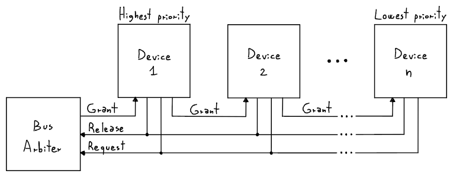

# Arbitraggio

Se più di due dispositivi devono comunicare su un _bus_, è necessario un **arbitraggio** per **evitare conflitti**.

Un modo è a **Daisy Chain**, in cui ogni dispositivo _master_ che vuole comunicare è posto in **ordine di priorità**:

Per usare il _bus_, un dispositivo $i$ **dovrà richiederlo** impostando _Request_ a `1`.
Quando lo riterrà possibile, l'arbitro alzerà il segnale _Grant_, **propagandolo per la catena** fino ad arrivare al dispositivo $i$.

Prima di arrivare però, uno dei dispositivi di maggiore priorità **potrebbe intercettare** il segnale e usare il _bus_ per se.
Alla fine del trasferimento _Release_ sarà attivato, che notificherà l'arbitro di impostare _Grant_ a `0`.

Lo svantaggio è che _non è equo_ verso i dispositivi di bassa priorità.
